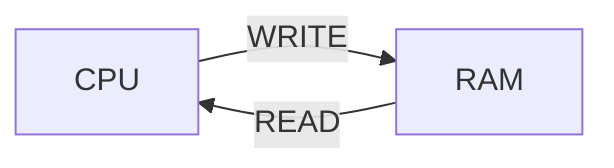

# Введение в ассемблер

На примере `x86`

Регистр IP (instruction pointer) содержит адрес команды.
Команды: языка ассемблера
Регистры:
16 битные (8 штук) - AX, CX, DX, BX, SP, BP, SI, DI

### Команда MOV
```nasm
B8 05 00		MOV			dst, src		; dst = src
B9 0A 00		MOV			AX, 5			; AX = 5
```
`MOV` может двигать содержимое памяти по адресу:
```nasm
	MOV		AX, [10] ; переместить в регистр из памяти по адресу 10
	MOV		AX, [BX] ; переместить в регистр из п-ти по адресу в BX
	MOV		[BX], AX ; переместить в память по адресу BX сод. AX
	MOV		[BX], [AX] ; WRONG! из памяти в память нельзя
```
### Команды арифметики
```nasm
	ADD		AX, CX ; AX = AX + CX
	SUB		AX, CX ; AX = AX - CX
	AND
	OR
	XOR
	INC		AX ; AX += 1
	DEC		AX ; AX -= 1
	;(INC и DEC с адресом тоже работают)
	NEG 	AX ; AX = -AX
	NOT 	AX ; AX = ~AX(побитово)
```
#### g++ -O2 -S -masm=intel s.cpp -- посмотреть ассемблированный код с оптимизацией 
```nasm
	; MUL и DIV - унарные опрации
	MUL 	BX ; DX:AX = AX * BX, где AX - младшие 16 бит, DX - старшие
	DIV 	BX ; AX = DX:AX / BX, логика такая же
	; IMUL и IDIV - знаковые умножение и деление
```
При этом в команде `DIV` если частное не помещается в `AX`, то это такая же ошибка, как деление на 0
## Команды перехода `JMP` и прочие
```nasm
.loop: ; метка
	INC AX
	JMP loop
```
`JMP` позволяет сделать бесконечный цикл
Основные условные переходы:
```nasm
	cmp		ax, bx ; сравнить меняет регистр флага
	je, jne - jump if (not) equal
	jg, jng - jump if (not) greater (signed)
	jl, jnl - jump if (not) less (signed)
	ja, jna - jump if (not) above (unsigned)
	jb, jnb - jump if (not) below (unsigned)
```
## Регистры флагов ( FLAGS Registers)
Выставляются после инструкций (`CMP`, арифметика и пр.)
```nasm
	CF - carry flag		; если рез. с битом переноса (для unsigned)
	ZF - zero flag 		; если рез. 0
	SF - sign flag 		; если рез. отрицательный
	OF - overflow flag 	; если рез переполнился (для signed)
```
Отсюда другие **команды перехода**:
```nasm
	jc, jnc - jump if (not) carry flag
	jz, jnz - jump if (not) zero flag
	js, jns - jump if (not) sign flag
	jo, jno - jump if (not) overflow flag
```

Многие команды расставляют флаги, выполняя операцию
`cmp` - сделай вычитание, но не записывай результат
`test` - побитовый &

Пример программы с метками и прыжками:
```nasm
.loop:
		mov			dx, ax
		add			ax, bx
		mov			bx, dx
		dec 		cx
		jnz			loop
```
### 32 битные регистры
`EAX, и другие обычные с приставкой E - extended`

## Команды сдвигов
```nasm
	shl - влево любой знак
	shr - вправо беззнаково (бит знака теряется)
	sar - вправо знаково (сохранение знака)
```
## Оптимизация и другие приколы
Команды деления (`DIV` и другие) работают медленно, поэтому компилятор  их обычно заменяет, например:
 a / 1 -> None
 a / 2 -> сдвиг
 a / 3 -> $\frac{a\frac{2^{N}}{3}}{2^{N}}$

## Команда `LEA`
```nasm
	lea ax, [bx] ; в [] не только регистр
```
`LEA` похожа на команду чтения из памяти, но в [] можно складывать. И вообще `LEA` перемещает указатель на данные, а `MOV` сами данные.
Так же `LEA` похожа на `ADD`
```nasm
	lea 	ax, [ax + 8]
	add		ax, 8
```
Эти две строки делают одно и тоже, только выполняются на разных блоках конвейера, а еще `lea` не трогает флаги, в отличие от `add`.

## Вызов функций и выход из них
Заходить и выходить из функций только в порядке стека
Есть специальный регистр `sp` который указывает на вершину стека.
```nasm
	push		eax
	pop			eax
```
Команды работы со стеком. Стек позволяет сохранять старые значения, которые необходимо вернуть
```nasm
	call 		label ; вызов ф-иии
	ret 			  ; выход из ф-ии
	; по своей сути эти строки равносильны:
	push		ip + 1	;(address of next instruction)
	jmp			label
	...
	pop			tmp
	jmp			tmp
```


> Written with [StackEdit](https://stackedit.io/). 
