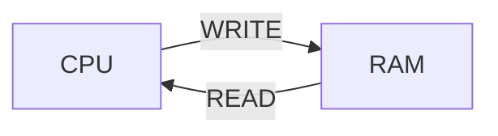

# Введение в ассемблер

Презентация - http://sorokin.github.io/cpp-course/lecture-1e.odp

На примере `x86`


Регистр IP (instruction pointer) содержит адрес команды.

16-битные регистры (8 штук): AX, CX, DX, BX, SP, BP, SI, DI

8-битные регистры (тоже 8): AL, AH, BL, BH, CL, CH, DL, DH

AL + AH = AX, аналогично другие.

### Команды read, write

```nasm
read (address)
write (address, value)
```


### Команда MOV

Команды для хранения в памяти кодируются:

```nasm
89 C2  mov dx,ax
```

```nasm
B8 05 00		mov			dst, src		; dst = src
B9 0A 00		mov			AX, 5			; AX = 5
```
`MOV` может двигать содержимое памяти по адресу:

```nasm
	mov		AX, [10] ; переместить в регистр из памяти по адресу 10
	mov		AX, [BX] ; переместить в регистр из п-ти по адресу в BX
	mov		[BX], AX ; переместить в память по адресу BX сод. AX
	mov		[BX], [AX] ; WRONG! из памяти в память нельзя
```
Команда ```MOV AX, [BX]``` читает из ячейки с адресом BX и BX + 1:

``` AX = mem[BX + 1] * 256 + mem[BX] ```


### Команды арифметики

```nasm
	cmd		dst, src
	
	add		AX, CX ; AX = AX + CX
	sub		AX, CX ; AX = AX - CX, аналогично AND, OR, XOR
	inc		AX ; AX += 1
	inc 	BYTE [BX] ; INC одного байта
	inc 	WORD [BX] ; INC числа из двух байт (дальше DWORD и т.д.)
	dec		AX 		; AX -= 1
	
	neg 	AX		; AX = -AX
	not 	AX		; AX = ~AX(побитово)
	
	mul		src  	; unsigned, результат в пару DX:AX = src*AX, DX - старшая часть, AX - младшая
	imul	BX   	; signed
	div		src  	; unsigned, AX = DX:AX / src, DX = DX:AX % src
	idiv	src  	; signed
	
```
Перед делением 16-битного зануляем регистр DX:

```nasm
xor DX, DX	; не MOV DX, 0, так как кодируется короче
div BX		;
```

```nasm
cwd			; сохраняет знак: берёт старший бит из AX, заполняет им DX 
idiv BX		; 
```

При этом в команде `DIV` если частное не помещается в `AX`, то это такая же ошибка, как деление на 0

#### g++ -O2 -S -masm=intel s.cpp -- посмотреть ассемблированный код с оптимизацией 

Смотреть ассемблерный код: https://godbolt.org/. Можно поиграться с такой функцией и посмотреть на оптимизации компилятора:

```c++
int foo(int a, int b){
    return a+b; // a-b компилится по-другому
}
```

Разные режимы адресации и оптимизация умножение:

```nasm
mov eax,[reg + 2 * reg + imm]
lea eax,[reg + 2 * reg + imm]	; load effective address. Возвращает адрес, по которому мы бы обратились
```

Как ~~избегается~~ оптимизируется деление (оно исполняется 20 тактов, не хотим так долго):

```c++
unsigned foo(unsigned a){
    return a/2; // здесь просто сделается сдвиг вправо, а если знаковое?
}
```

```nasm
shr eax ; беззнаковый сдвиг
sar eax ; сдвиг арифметический: сдвигается всё, кроме старшего и его раскопирует
```

Знаковое деление скомпилится так:

```nasm
mov     eax, edi
shr     eax, 31
add     eax, edi ; если число отрицательное, то добавляем 1
sar     eax
```

Округления: обычное деление в **C** округляет в сторону 0, ```sar``` округляет к -inf.

А что будет с ```unsigned ```делением на 3? А оно скомпилится вот так:

```nasm
mov     eax, edi
mov     edi, 2863311531 ; обратное по модулю
imul    rax, rdi
shr     rax, 33			
```

Почему это лучше? Можем посчитать константу при компиляции, получаем выигрыш в эффективности.

## Команды перехода `JMP` и прочие
```nasm
.loop: ; метка
	INC AX
	JMP loop
```
`JMP` позволяет сделать бесконечный цикл
test
Основные условные переходы:
```nasm
	cmp		ax, bx ; сравнить меняет регистр флага
	je, jne - jump if (not) equal
	jg, jng - jump if (not) greater (signed)
	jl, jnl - jump if (not) less (signed)
	ja, jna - jump if (not) above (unsigned)
	jb, jnb - jump if (not) below (unsigned)
```
## Регистры флагов ( FLAGS Registers)
Выставляются после инструкций (`CMP`, арифметика и пр.)
```nasm
	CF - carry flag		; если рез. с битом переноса (для unsigned)
	ZF - zero flag 		; если рез. 0
	SF - sign flag 		; если рез. отрицательный
	OF - overflow flag 	; если рез переполнился (для signed)
```
Отсюда другие **команды перехода**:
```nasm
	jc, jnc - jump if (not) carry flag
	jz, jnz - jump if (not) zero flag
	js, jns - jump if (not) sign flag
	jo, jno - jump if (not) overflow flag
```


Многие команды расставляют флаги, выполняя операцию:
`cmp` - сделай вычитание, но не записывай результат
`test` - побитовый &

Пример программы с метками и прыжками:
```nasm
.loop:
		mov			dx, ax
		add			ax, bx
		mov			bx, dx
		dec 		cx
		jnz			loop
```
### 32 битные регистры
`EAX, и другие обычные с приставкой E - extended`

## Команды сдвигов
```nasm
	shl - влево любой знак
	shr - вправо беззнаково (бит знака теряется)
	sar - вправо знаково (сохранение знака)
```
## Оптимизация и другие приколы
Команды деления (`DIV` и другие) работают медленно, поэтому компилятор  их обычно заменяет, например:
 a / 1 -> None
 a / 2 -> сдвиг
 a / 3 -> $\frac{a\frac{2^{N}}{3}}{2^{N}}$

## Команда `LEA`
```nasm
	lea ax, [bx] ; в [] не только регистр
```
`LEA` похожа на команду чтения из памяти, но в [] можно складывать. И вообще `LEA` перемещает указатель на данные, а `MOV` сами данные.
Так же `LEA` похожа на `ADD`

```nasm
	lea 	ax, [ax + 8]
	add		ax, 8
```
Эти две строки делают одно и тоже, только выполняются на разных блоках конвейера, а еще `lea` не трогает флаги, в отличие от `add`.

## Вызов функций и выход из них
Заходить и выходить из функций только в порядке стека
Есть специальный регистр `sp` который указывает на вершину стека.
```nasm
	push		eax
	pop			eax
```
Команды работы со стеком. Стек позволяет сохранять старые значения, которые необходимо вернуть
```nasm
	call 		label ; вызов ф-иии
	ret 			  ; выход из ф-ии
	; по своей сути эти строки равносильны:
	push		ip + 1	;(address of next instruction)
	jmp			label
	...
	pop			tmp
	jmp			tmp
```


> Written with [StackEdit](https://stackedit.io/). 
<!--stackedit_data:
eyJoaXN0b3J5IjpbMzI3NDQ1Nzg5XX0=
-->