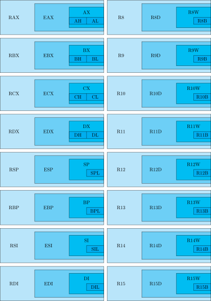
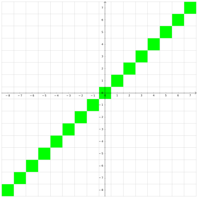
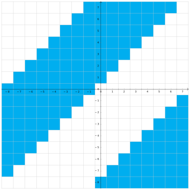
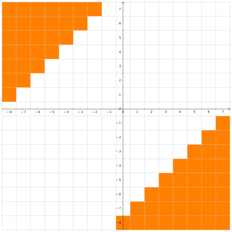

# Введение в ассемблер
- [Слайды с лекции №1](slides/lecture-1j.pdf)
- [Слайды с лекции №2](slides/lecture-2d.pdf)
- [Запись лекции №1](https://www.youtube.com/watch?v=bTgtesThdSg)
- [Запись лекции №2](https://www.youtube.com/watch?v=XY8xN1Ug1_k)
---
## Мотивация.
На кой мы изучаем ассемблер и работу процессора в курсе по C++? А вот тому есть сразу несколько причин:
1) Когда мы будем говорить про языковые конструкции, мы обсудим не только то, как они работают, но ещё и почему именно так. Почему, например, лямбды без списка захвата приводятся к указателю на функцию, а со списком — нет? Без изучения основ архитектуры компьютера, мы не сможем ответить на этот вопрос, а с этим изучением просто не сможем представить себе, как может быть иначе.
2) Есть более практический аспект: если вы что-то желаете ускорить, то высокоуровневые оптимизации (убрать ненужное действие, не считать что-то дважды) — это легко, а более низкоуровневые вообще нельзя сделать без знаний того, как внутри компьютер работает.
3) Ещё основы архитектуры компьютера пригодятся при отладке. Если программа работает не так, то для понимания, где же именно ошибка, нам требуется понимать, что внутри процессора происходит.
4) И наконец есть более философская полезность: если вы чем-то пользуетесь, то чем лучше вы разбираетесь, как оно работает, тем грамотнее можете этим пользоваться. То же самое с библиотеками, например (если библиотека что-то умеет, а вы не знаете об этом, вы начинаете городить костыли). Например, в x86 есть специальная инструкция с длинной арифметикой, и лучше бы писать такой код, чтобы компилятор догадался пользоваться ей.
## Базовое представление об устройстве оперативной памяти.
В нашем курсе мы построим некоторую простую модель компьютера, а потом будет её изучать и уточнять по необходимости. В нашей простой модели оперативная память — массив чисел в диапазоне $[0:255]$. Вы умеете обращаться к этому массиву по индексу. Этот индекс называется *адресом в памяти*. **Обращаться к конкретному биту вы не умеете**, и притом даже не знаете, какой бит у числа в начале, а какой — в конце.

Как в этой модели исполняется программа? Следующим образом: у процессора есть регистр `IP` (instruction pointer), где записан адрес той инструкции, которую надо исполнять. При её исполнении значение в регистре увеличивается, тем самым начиная указывать на следующую инструкцию.
## Ассемблер.
Помимо регистра `IP`, процессор имеет ещё 8 регистров, которые, в отличие от `IP` являются регистрами общего назначения (т.е. пользоваться ими вы можете как вам хочется). Эти регистры имеют название... Стоп, а зачем регистрам название? А потому что вам иногда надо прописывать процессорные инструкции руками, а запоминать последовательности байтов вы не хотите. И для этого были придуманы системы человеко-читаемых мнемоник, называемых *ассемблером*. При этом **мнемоники различаются в зависимости от инструмента, которым вы пользуетесь**, а не только в зависимости от системы. Впрочем, на одной архитектуре мнемоники в любом случае достаточно схожи.
### Полезные инструменты.
Чтобы увидеть, во что ваш компилятор превращает ваш код, пишите `g++ -S -masm=intel ...`, после чего вам создадут `.s` файл с ассемблерными командами. Или можно использовать https://godbolt.org, куда можно запихнуть разные компиляторы, параметры оптимизации и прочее, и сразу увидеть результат (причём понятнее, чем в `g++`). Ещё, кстати, на https://godbolt.org можно навести на команду и узнать информацию по ней. Если нужно больше информации об ассемблерной инструкции — зайдите на https://felixcloutier.com/x86/.
## Регистры.
Итак, помимо регистра `IP`, процессор имеет ещё 8 регистров, которые, в отличие от `IP` **являются регистрами общего назначения (т.е. пользоваться ими вы можете как вам хочется)**. Эти регистры имеют название `AX`, `CX`, `DX`, `BX`, `SP`, `BP`, `SI`, `DI`. Каждый из них имеет 16 битную разрядность, а последние 4 ещё и некий особый смысл, к которому скоро перейдём. Помимо них также есть следующее:

- **8-битные версии регистров**: `AL`, `AH`, `BL`, `BH`, `CL`, `CH`, `DL`, `DH`, `SPL`, `BPL`, `DIL`, `SIL`. Для регистров `*X` его старшие 8 бит называются `*H`, а младшие — `*L`. У оставшихся четырёх есть только младшие, получаемые дописыванием `L` к названию регистра.
- **32-битные версии регистров** (since 1985): `EAX`, `EBX`, ..., `EDI`. (Приставка "`E`" обозначает "*extended*".) Оригинальные 16-битные регистры являются младшей частью расширенных.
- **64-битные версии регистров** (since 2003): `RAX`, `RBX`, ..., `RDI`. (Приставка "`R`" обозначает "*re-extended*".) "Расширенные" 32-битные регистры являются младшей частью пере-расширенных.
- **Дополнительный набор регистров** (x86-64): `R8`, `R9`, ..., `R15`, `R8D`, `R9D`, ..., `R15D`, `R8W`, `R9W`, ..., `R15W`, `R8B`, `R9B`, ..., `R15B`. Регистры `R*` имеют 64-битную ширину, `R*D` (от слова "*dword*") — младшие 32 бита соответствующего регистра, `R*W` (от слова "*word*") — младшие 16, `R*B` (от слова "*byte*") — младшие 8.


## Команда `mov`.
`mov dst, src` является простым присваиванием `dst = src`. В качестве её аргументов могут выступать регистры, константы или даже места в памяти. По поводу последнего: если вы хотите положить в регистр `AX` число десять, это пишется так: `mov AX, 10`, а если значение в десятой ячейке памяти, то адрес берётся в квадратные скобки: `mov AX, [10]`. Также в квадратные скобки можно брать регистр.

Все эти разные типы аргументов команды `mov` на самом деле даже по-разному кодируются. Как пример, присваивание числа в регистр и регистра в регистр занимают 2 и 5 байтов соответственно:
```nasm
89 C2         		mov		edx, eax	; EDX = EAX
B8 05 00 00 00		mov		eax, 5		; EAX = 5
```
Некоторые сочетания закодировать нельзя никак (например, `mov [AX], [BX]`). А если детальнее, то возможны вот такие комбинации регистров (`reg`) и чисел (`imm`):
- `mov reg, reg`
- `mov reg, imm`
- `mov reg, [reg]`
- `mov reg, [imm]`
- `mov [reg], reg`
- `mov [imm], reg`
- `mov [reg], imm`
- `mov [imm], imm`

Возникает вопрос. Регистр `AX` шестнадцати-битный, а адрес указывает на байт. Значит при выполнении команды `mov` нужно откуда-то взять ещё 8 бит. А вот **читается не только тот адрес, который запросили, но ещё и следующий**. Но какой из прочитанных байт старший, а какой — младший? В разных архитектурах возможны разные варианты.
- Если значения в меньшем адресе являются младшими разрядами, то это называется *little-endian*.
- Если значения в большем адресе являются младшими разрядами, то это называется *big-endian*.

<u>Пример</u>: Если в ячейке с номером 100 записан байт `0x6C`, а с номером 101 — `0xAA`, то в LE при чтении ячейки `[100]` мы получим число `0xAA6C`, а в BE — `0x6CAA`.

**В x86 используется только little-endian.**

## Команды арифметики.
### Базовые бинарные операции.
Процессор умеет выполнять базовые бинарные операции, которые в ассемблере называются `add`, `sub`, `and`, `or`, `xor`. Все они работают как комбинация операции и присваивания (т.е. соответственно `+=`, `-=`, `&=`, `|=`, `^=`). **Совершать операции можно только с числами одинакового размера** (как и с `mov`). Для бинарных операций возможны такие комбинации регистров и чисел, как и для `mov` (см. выше).
### Унарные операции.
Простые унарные операции `inc`, `dec`, `not`, `neg` также работают как операция с присваиванием (то есть соответственно, `x = x + 1`, `x = x - 1`, `x = ~x`, `x = -x`). Понятно, что в случае, когда мы оперируем с ячейками памяти, надо явно уточнить, с числами какого размера производится операция. В ассемблере это пишется, например, так `inc byte [addr]`. `byte` подразумевает 8 бит. Вместо него можно написать `word`, `dword` или `qword`, подразумевая соответственно 2, 4 и 8 байтов.
### Умножение и деление.
Умножение принимает один аргумент, умножая его на регистр `AL`/`AX`/`EAX`/`RAX`. Результат умножения занимает вдвое больше знаков, чем аргумент и записывается либо в регистр `AX` (для 8-битного), либо в пары регистров `DX:AX`, `EDX:EAX`, `RDX:RAX` (для 16-, 32- и 64-битного соответственно). `DX` — старшая половина разрядов.

Несложно заметить, что в отличие от сложения и вычитания, умножение и деление разное для знаковых и беззнаковых чисел. Поэтому существуют два разных умножения (`mul` и `imul`) и два разных деления (`div` и `idiv`). Первое для беззнаковых чисел, второе — для знаковых.

Деление работает схожим образом. Оно принимает делимое из `AX`/`DX:AX`/`EDX:EAX`/`RDX:RAX`, делитель как аргумент, а частное возвращает в регистр `AL`/`AX`/`EAX`/`RAX`. Но также деление возвращает остаток, и его оно возвращает в `AH`/`DX`/`EDX`/`RDX`.

Вопрос: как поделить друг на друга числа одинакового размера? Ну, нужно преобразовать, например, 16-битное число в 32-битное. В случае, если числа беззнаковые, надо просто обнулить `DX` (**обычно регистр обнуляется при помощи `xor DX, DX`, потому что эта инструкция занимает меньше памяти, нежели `mov DX, 0`**). Те, кто знают, как работает дополнение до 2, также знают, что нужно делать в знаковом случае. Нужно заполнить `DX` знаковым битом `AX`. Для этого в x86 есть специальная инструкция `cwd`. Для того чтобы сделать то же самое с `EDX` и `RDX`, есть инструкции `cdq` и `cqo` соответственно.

Хорошо, про деление мы знаем уже почти всё, кроме того, что будет, если мы поделим на 0. Или если результат в нужные регистры не поместится. Обе эти ситуации приводят к системным прерываниям, которые работают следующим образом: процессор имеет массив IDTR (**Interrupt Descriptor Table Register**), в котором для каждого типа прерывания сказано, что с ним делать. Этот массив при запуске подготавливает операционная система.
### Сдвиги.
Ещё в x86 есть
- **`SHL`/`SAL` — сдвиг влево**
- **`SHR` — логический сдвиг вправо (оставляет на пустых местах нули)**
- **`SAR` — арифметический сдвиг справа (на пустые места пихает знаковый бит)**.

В C++ для беззнаковых используется `SHL` и `SHR`, а для знаковых — `SAL` и `SAR`.
## Оптимизации компилятора.
Давайте забьём в https://godbolt.org следующий код:
```c++
int foo(int a, int b) {
    return a + b;
}
int bar(int a, int b) {
    return a - b;
}
```
В результате увидим нечто неизвестное:
```nasm
f(int, int):
    lea     EAX, [RDI+RSI]
    ret
g(int, int):
    mov     EAX, EDI
    sub     EAX, ESI
    ret
```
Несложно догадаться, что обе функции получают свои аргументы в регистрах `EDI` и `ESI`, а возвращают — в `EAX`. Но непонятно, что такое `LEA`.
### Команда `LEA`.
`LEA` расшифровывается как "*load effective address*" и вторым её аргументом всегда является адрес памяти. Именно этот адрес присваивается в первый аргумент инструкции. Здесь она используется как альтернатива `ADD`+`MOV`.

Как несложно заметить, в качестве адреса можно писать сумму значений в регистрах. А что ещё можно? А вот что: **`[reg+i*reg+const]` где `i` равно `1`, `2`, `4` или `8`**.

**Еще `LEA` не трогает флаги, в отличие от `ADD`.** Что такое флаги — смотри дальше. Детальнее про `LEA` можно почитать [здесь](https://stackoverflow.com/questions/1658294/whats-the-purpose-of-the-lea-instruction) (первые 2 ответа).
### Как ~~избегается~~ оптимизируется деление:
Деление занимает много больше тактов, чем другие арифметические операции, а во время его вычисления весь конвейер стоит. Компиляторы стараются избегать операции деления, если это возможно. Например, мы знаем, что **беззнаковое** деление или умножение на $2^k$ можно легко заменить на сдвиг на $k$. Поэтому следующий код на C++:
```c++
unsigned foo(unsigned a) // беззнаковый тип
{
    return a / 2;
}
```
Может быть оптимизирован компилятором до
```nasm
foo(unsigned int):
    mov     EAX, EDI
    shr     EAX
    ret
```
А вот просто сдвинуть знаковое число вместо деления нельзя, потому что у этих двух операций округления в разные стороны. Поэтому тот же код, но с сигнатурой `int foo(int a)` скомпилируется так:
```nasm
foo(int):
	mov     EAX, EDI
	shr     EAX, 31  ; Оставляем от числа только старший (знаковый) бит.
	add     EAX, EDI ; Если число отрицательное, то добавляем 1 (чтобы при a = -1 всё работало).
	sar     EAX      ; Арифметический сдвиг вправо на 1 бит.
ret
```
А что будет с беззнаковым делением на 3? А тут есть другие хаки:
```nasm
foo(unsigned int):
    mov     EAX, EDI
    mov     EDX, 2863311531 ; 0xAAAAAAAB или 2^33/3
    imul    RDX
    shr     RAX, 33
    ret
```
Почему это лучше? Как мы уже обсудили, деление дорогое, а константу можем посчитать при компиляции, получая выигрыш в эффективности.

Почему это работает? Потому что при арифметике с переполнением деление на константу можно выполнить через умножение:
$$\frac a3=\frac{a\cdot(2^{33}/3)}{2^{33}} = (a\cdot2863311531) \gg 33$$
А в общем случае компиляторы пытаются подобрать $n$ (равное тут $33$), чтобы такая замена работала как требуется. Больше подобного рода трюков можно почитать в книжке Hacker's Delight.

## Control-flow.
Мы уже понимаем, что компилятор делает с арифметическими выражениями, а значит линейный код мы уже можем перевести на ассемблер руками. А вот ветвления и циклы — пока нет. Как они идейно работают? У процессора есть команды, которые называются branch’ами. Самая простая из них — `jmp` (своего рода `goto`). Её аргументом является число, которое нужно прибавить к `IP`, чтобы перейти на адрес новой инструкции. В ассемблере, однако, это вместо этого пишется метка, по которой и осуществляется переход.
```nasm
.loop: ; метка
    inc     AX
    jmp     .loop
```
Помимо `jmp` есть *conditional branch* (то есть переход, если выполнено какое-то условие). Осуществляются они комбинацией команды `cmp` и какой-то из команд `je`, `jg`, `jl` или подобной. Первая команда (пока непонятным нам образом) сравнивает два регистра, а потом вторая получает результат этого сравнения и совершает переход только в определённом случае. В таблице ниже перечислены условия
для каждой из команд:
<!-- https://www.tablesgenerator.com/markdown_tables -->
| Команда |             Эквивалент              |     Расшифровка     |
|:-------:|:-----------------------------------:|:-------------------:|
|  `je`   |           `left == right`           |    jump if equal    |
|  `jg`   |   `(signed)left > (signed)right`    |   jump if greater   |
|  `jl`   |   `(signed)left < (signed)right`    |    jump if less     |
|  `ja`   | `(unsigned)left > (unsigned)right`  |    jump if above    |
|  `jb`   | `(unsigned)left < (unsigned)right`  |    jump if below    |
|  `jne`  |           `left != right`           |  jump if not equal  |
|  `jng`  |   `(signed)left <= (signed)right`   | jump if not greater |
|  `jnl`  |   `(signed)left >= (signed)right`   |  jump if not less   |
|  `jna`  | `(unsigned)left <= (unsigned)right` |  jump if not above  |
|  `jnb`  | `(unsigned)left >= (unsigned)right` |  jump if not below  |

### Регистры флагов (FLAGS Registers).
Теперь давайте всё же поговорим, как работает `cmp`? Для этого нам нужно поговорить о такой штуке как регистр флагов. Он содержит, собственно, битовые флаги. Из их большого набора нас интересуют
- CF — carry flag.
- ZF — zero flag.
- SF — sign flag.
- OF — overflow flag.

В процессе своей работы разные инструкции устанавливают различные флаги (какие-то инструкции на определённые флаги не влияют, у каких-то инструкций эти флаги имеют свое значение, поэтому читайте документацию). А мы рассмотрим, как
с ними работают инструкции `add` и `sub`. Они выставляют:
- ZF — если результат равен 0.
- SF — если результат отрицательный.
- CF — если произошёл перенос в сложении/заимствование в вычитании беззнаковых чисел.
- OF — если знаковая операция вызвала переполнение.

С флагами можно взаимодействовать не только при помощи уже обсуждённых инструкций условного перехода, но и, например, при помощи команды `adc`, которая выполняет сложение, но также добавляет к результату CF.

Или есть ещё **команды перехода, основанные на флагах**:
- `jz` — jump if ZF.
- `js` — jump if SF.
- `jc` — jump if CF.
- `jo` — jump if OF.
- `jnz` — jump if not ZF.
- `jns` — jump if not SF.
- `jnc` — jump if not CF.
- `jno` — jump if not OF.

### Как работают арифметические условные переходы.
`cmp` устанавливает флаги так же, как это делает вычитание. Отсюда посмотрим, какие флаги проверяются какими условными переходами.

Про `je`, `jb` и `ja` всё понятно. `je` выполняется при ZF, `jb` — при CF, `ja` — если ZF и CF оба ложны. А что с `jl` и `jg`, сейчас обсудим.

Давайте рассмотрим числа из 3 бит простоты и наглядности ради, и пометим цветом те места, где `CMP` задаёт определённые флаги. ZF — очевидно.



Теперь посмотрим на SF. Если мы вычитаем из маленького числа число чуть побольше, то результат будет отрицательным. Но если мы, например, из $-8$ вычитаем что-то, то происходит переполнение, и результат получается положительным. Аналогично если мы из положительного числа вычитаем большое отрицательное, может произойти переполнение в обратную сторону, и результат станет отрицательным. Учитывая это, имеем, что SF задан в этой области:



А ещё мы уже обсудили переполнение, и можем сказать, где задан OF:



| Ветвление |       Условие       |
|:---------:|:-------------------:|
|   `je`    |        `ZF`         |
|   `jg`    | `(SF == OF) && !ZF` |
|   `jl`    |     `SF != OF`      |
|   `ja`    |    `!CF && !ZF`     |
|   `jb`    |        `CF`         |

Кстати, несмотря на то, что в ассемблере есть `je` и `jz`, по сути они делают одно и то же, и даже одинаковым набором байт обозначаются (поэтому **если вы будете ассемблировать-дизассемблировать код, учтите, что в коде ASM `je` может замениться на `jz` или наоборот**).

Помимо `cmp` есть ещё одна инструкция, которая не делает ничего, кроме расстановки флагов — `test`. Она делает побитовое "И" аргументам и ставит:
- ZF, если результат равен нулю.
- SF, если результат отрицательный.
- CF, никогда (всегда ставится в `false`).
- OF, никогда (всегда ставится в `false`).

<u>Пример</u>:
```nasm 
	test	AX, AX ; проверка на 0
	jz		label
```

Иногда ни `test`, ни `cmp` не нужны, потому что многие инструкции ставят флаги, и иногда так, как вам нужно.
<u>Пример</u>:
```nasm
.loop:
	mov		DX, AX
	add		AX, BX
	mov		BX, DX
	dec		CX
	jnz		.loop
```

## Работа с функциями.
### Основы работы со стеком.
Вопрос на засыпку: как реализовать рекурсию? Да и в принципе, вызов функций? Мы выходим только из той функции, в которую зашли последней. Это, барабанная дробь, *стек*. Стек — это кусочек памяти, **его вершина имеет меньший адрес**, а дно — больший. На вершину стека указывает регистр `SP`, название которого так и расшифровывается — *stack pointer*.

Процессор предоставляет две базовые функции работы со стеком — `push` и `pop`. Несложно догадаться, что `push src` равносильно
```nasm
    sub     RSP, 8
	mov     [RSP], src
```
А `pop dst` — 
```nasm
    mov     dst, [RSP]
    add     RSP, 8
```
Ещё есть две "более высокоуровневые" инструкции — `call` и `ret`. Первая принимает своим единственным аргументом метку (адрес функции, которую нужно вызвать), кладёт на стек адрес следующей инструкции и делает переход по метке. Вторая берёт со стека адрес и переходит по нему. Несложно заметить, что именно так функции и работают. Честно написать, чему эти инструкции равносильны, невозможно, потому что нельзя лёгким образом получить доступ к `IP`.
### Передача параметров в функцию.
Быстрее и проще всего положить параметры в регистры (например, `EDI` и `ESI`). Но регистров у нас конечное число, поэтому если параметров много, то может не хватить. В таком случае параметры можно передавать через стек. И чтобы получить их, мы делаем `mov RAX, [RSP+8]` или `mov RAX [RSP+16]`. Но после возвращения из функции, у нас параметры всё ещё на стеке, надо, чтобы кто-то его почистил. Можем
сделать так, чтобы вызывающая функция почистила стек, прибавляя константу к `RSP` каждый раз после вызова. Но не лучше ли запихнуть это в вызываемую функцию? Ну, идейно да, но надо куда-то сохранить возвращаемое значение... В x86 вообще есть `ret n`, который берёт значение, сдвигает `RSP` на `n` и возвращается. Это называется «вызываемая функция чистит стек». Осталось понять, что делать с локальными переменными? А, их можно положить выше на стек после адреса возврата.
### ABI
Хорошо, а кто определяет, как передавать параметры? А этим занимается *ABI* - application binary interface. ABI содержит вообще всю информацию, необходимую для взаимодействия, например, вас с операционной системой.
- Выравнивание и размеры типов данных.
- Соглашение о передаче параметров, о том, кто чистит стек, о том, в каком порядке параметры на стек кладутся.
- Как выполняются системные вызовы.
- Наличие `red zone` (например, она есть на 64-битных линуксах)

Что такое `red zone`? Это кусок памяти ниже указателя стека, который никто, кроме нас, не имеет права использовать. На 64-битных линуксах размер этого куска — 128 байт. То есть можно безопасно использовать 128 байт ниже стека, никто ничего с ними не сделает при системном прерывании.

Заметим, что на x86 Windows `red zone`'ы нет.

А почему нельзя использовать память ниже стека, если нет `red zone`? Потому что не гарантируется, что память ниже стека никто не будет использовать. Например, обработчик прерываний использует стек, кладёт туда свои данные.

Всё это — ABI. Обычно он привязан к ОС.

Windows из данного правила является исключением: в нём есть [целая табличка](https://docs.microsoft.com/en-gb/cpp/cpp/argument-passing-and-naming-conventions) о том, какой из миллиона (`cdecl`, `stdcall`, `thiscall`, `fastcall`, ...) способов передавать параметры, что делает. И можно в коде прямо на функции явно написать, какой способ использовать. Даже свой собственный можете сделать.

А кто, кстати, обычно чистит стек? Вызывающая функция. Почему так, это же, вроде как, неудобно? Потому что существуют variadic-функции. Когда вы делаете `printf`, компилятор просто пихает параметры на стек, а вызываемая функция не знает, сколько их. Поэтому чистит вызывающая, которая знает.
#### Системные вызовы.
`syscall` - интерфейс взаимодействия процесса программы с ядром ОС. Например, это чтение/запись в файл/терминал, завершение программы с кодом ошибки и т.д.

### Стековый фрейм.
Можно заметить, что под GCC код
```c++
int foo(char const*);

int bar()
{
    char arr[40];
    return foo(arr) + 1;
}
```
с флагами `-O2 -fno-omit-frame-pointer` компилируется во что-то такое:
```nasm
bar():
	push	RBP
	mov		RBP, RSP
	sub		RSP, 48

    lea     RDI, [RBP-48]
    call    foo(char const*)

	mov		RSP, RBP
	pop		RBP
	ret
```
Нам интересна обёртка `push RBP`, `mov RBP, RSP`, ..., `pop RBP`. Зачем это? Посмотрим, что делает этот код. Он сохраняет старое значение `RBP` на стек. А при вызове рекурсивной функции в `RBP` будет `RSP`. То есть во внутренней функции мы запихаем на стек адрес первой. И так далее. То есть на стеке есть односвязный список значений `RBP` от нового к старому. Поэтому пойдя по `RBP`, можем напечатать весь стек (это называется *unwind* — *раскрутка* стека). Буквально так очень давно работали отладчики. В наше время этот режим менее актуален, поэтому генерировать эти инструкции избыточно. Вместо этого компиляторы вместе с кодом генерируют отладочную информацию как раз о том, какие команды каким строкам кода соответствуют, как раскручивать стек и подобное. gcc генерирует стековый фрейм только с некоторым ключом. MSVC генерирует его по умолчанию. Возможно, это потому, что рандомная опубликованная exe'шка может в отладочных данных содержать секретики. Их вы публиковать не хотите, поэтому только стековые фреймы. К чему это всё для нас? Если вы пользуетесь какими-то инструментами, которые снимают стек (отладчик или профилировщик), убедитесь, что у
вас есть отладочные символы, и отлаживаете вы тоже согласно им. Либо и то, и другое по стековому фрейму.

### Выделение памяти:
```c++
void f(char const*);

void g()
{
    char arr[113];
    f(arr);
}
```

Компилируется в:

```nasm 
g():
    sub     RSP, 136
    mov     RDI, RSP
    call    f(char const*)
    add     RSP, 136
    ret
```

К локальным переменным обращаемся через `RSP`, лежат на стеке. Размер стека - переменная на уровне операционной системы (вроде).

Обратим внимание на то, что если изменить размер массива на __112__, то этот код скомпилируется в:

```nasm
g():
    sub     RSP, 120
    mov     RDI, RSP
    call    f(char const*)
    add     RSP, 120
    ret
```

Почему `136` изменилось на `120`? Этот эффект называется выравниванием (alignment).

В качестве основной единицы работы с памятью используется *машинное слово*, размер которого обычно составляет несколько байт. Так называемый *unaligned access* сложен в реализации на аппаратном уровне, поэтому обращения по произвольному адресу либо не поддерживаются (и вызывают исключение процессора), либо поддерживаются, но работают медленно. Обычно компилятор выравнивает данные по границам машинных слов, в нашем случае `8 + 16 * k`.
