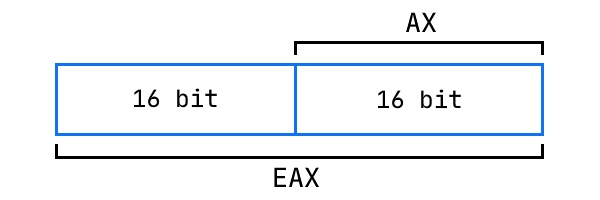
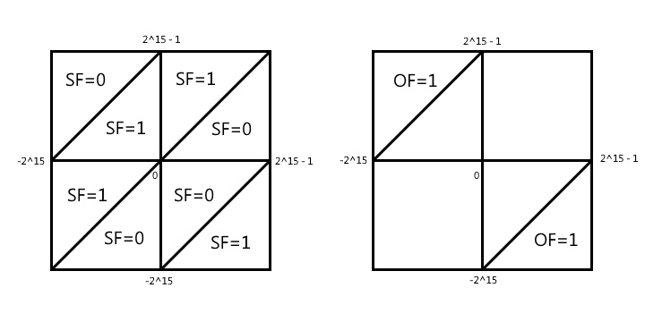

# Введение в ассемблер
- [Слайды с лекции](slides/lecture-1.pdf)
- [Запись лекции №1](https://www.youtube.com/watch?v=bTgtesThdSg)
- [Запись лекции №2](https://www.youtube.com/watch?v=XY8xN1Ug1_k)
---
## Основные регистры и команды

Регистр `IP` (instruction pointer) содержит адрес команды.

- **16-битные регистры** (8 штук): AX, CX, DX, BX, SP, BP, SI, DI 
- **8-битные регистры** (тоже 8): AL, AH, BL, BH, CL, CH, DL, DH. AL + AH = AX, аналогично другие.
- **32-битные регистры:** EAX, и другие обычные с приставкой E - extended
  
### Команды read, write

```nasm
read (address)
write (address, value)
```

### Команда mov

Команды для хранения в памяти кодируются:

```nasm
89 C2			mov		edx, eax	; EDX = EAX
B8 05 00 00 00		mov		eax, 5		; EAX = 5
```
`mov` может копировать содержимое памяти по адресу:

```nasm
	mov		ax, [10]	; Переместить в регистр из памяти по адресу 10
	mov		ax, [bx]	; Переместить в регистр из памяти по адресу в BX
	mov		[bx], ax	; Переместить в память по адресу BX содержимое AX
	mov		[bx], [ax]	; WRONG! из памяти в память нельзя. Оно даже не скомпилируется
```

Команда ```mov ax, [bx]``` читает из ячейки с адресом BX и BX + 1:

```AX = mem[BX + 1] * 256 + mem[BX]```

### Команды арифметики

```nasm
	cmd		dst, src

	add		ax, cx		; AX = AX + CX
	sub		ax, cx		; AX = AX - CX, аналогично AND, OR, XOR
	inc		ax		; AX += 1
	inc		BYTE [bx]	; INC одного байта
	inc		WORD [bx]	; INC числа из двух байт (дальше DWORD и т.д.)
	dec		ax		; AX -= 1

	neg		ax		; AX = -AX
	not		ax		; AX = ~AX(побитово)

	mul		src		; unsigned, в пару DX:AX = src*AX, DX - старшая часть, AX - младшая
	imul		src		; signed
	div		src		; unsigned, AX = DX:AX / src, DX = DX:AX % src
	idiv		src		; signed
```
Перед делением 16-битного зануляем регистр DX:

```nasm
	xor		dx, dx		; не "mov dx,0", так как кодируется короче
	div		bx
```

```nasm
	cwd				; сохраняет знак: берёт старший бит из AX, заполняет им DX
	idiv		bx
```

При этом в команде `DIV` если частное не помещается в `AX`, то это такая же ошибка, как деление на 0

### Команды сдвигов

```nasm
shl - Сдвиг влево
shr - Логический сдвиг вправо (бит знака теряется)
sar - Арифметический сдвиг вправо (сохранение знака)
```

## Оптимизации компилятора:

```g++ -O2 -S -masm=intel s.cpp``` -- посмотреть ассемблированный код с оптимизацией.

Онлайн компилятор-дизассемблер: https://godbolt.org/. Можно поиграться с такой функцией и посмотреть на оптимизации компилятора:

```c++
int foo(int a, int b) {
    return a + b; // использует lea вместо add
    // a - b использует sub
}
```

### Команда `LEA`

```nasm
	lea		ax, [bx] 	
	; в [] не только регистр, мб арифметическое выражение из них
```

`LEA` записывает в dst выражение из [ ] (как "mov src,[dst + ...]", но пишутся не данные по адресу, а сам адрес).

Также `LEA` может использоваться вместо `ADD`:

```nasm
	lea		ax, [ax + 8]
	add		ax, 8
```

Эти две строки делают одно и тоже, только выполняются на разных блоках конвейера, а еще `lea` не трогает флаги, в отличие от `add`.

Подробнее [здесь](https://stackoverflow.com/questions/1658294/whats-the-purpose-of-the-lea-instruction) (первые 2 ответа).

### Как ~~избегается~~ оптимизируется деление:

Деление занимает много больше тактов, чем другие арифметические операции, а во время его вычисления весь конвейер стоит. Компиляторы стараются избегать операции деления, если это возможно.

Следующий код на C++:

```c++
unsigned foo(unsigned a) // беззнаковый тип
{
    return a / 2;
}
```

Может быть оптимизирован компилятором до

```nasm
	mov		eax, edi	; Аргумент находится в edi
	shr		eax		; Логический сдвиг вправо, второй аргумент по умолчанию 1
	ret
```

Со знаковым аргументом деление скомпилится так:

```nasm
	mov		eax, edi
	shr		eax, 31		; Оставляем старший бит (знак)
	add		eax, edi	; Если число отрицательное, то добавляем 1 (чтобы при a=-1 всё работало)
	sar		eax		; Арифметический сдвиг вправо на 1 бит
```

А что будет с ```unsigned``` делением на 3? А оно скомпилится вот так:

```nasm
	mov		eax, edi
	mov		edi, 2863311531	; 0xAAAAAAAB или 2^33/3
	imul		rax, rdi
	shr		rax, 33
```

Почему это лучше? Деление дорогое, а константу можем посчитать при компиляции, получая выигрыш в эффективности.

Почему это работает? Потому что при арифметике с переполнением деление на константу можно выполнить через умножение:

`a / 3 = (a * 2^33) / (3 * 2^33) = (a * 2863311531) >> 33`

## Команды перехода `JMP` и прочие
```nasm
.loop: ; метка
	inc		ax
	jmp		loop ; как присваивание в регистр IP
```
`JMP` позволяет сделать бесконечный цикл

Основные условные переходы:

```nasm
	cmp		ax, bx ; сравнить меняет регистр флага
	je, jne - jump if (not) equal
	jg, jng - jump if (not) greater (signed)
	jl, jnl - jump if (not) less (signed)
	ja, jna - jump if (not) above (unsigned)
	jb, jnb - jump if (not) below (unsigned)
```

## Регистры флагов (FLAGS Registers)
Большой (до 64 бит) регистр, каждый бит - какой-то флаг.
Выставляются после инструкций (`CMP`, арифметика и пр.)

```nasm
	ZF - zero flag 		; если рез. 0
	SF - sign flag 		; если рез. отрицательный
	CF - carry flag		; если рез. с битом переноса (для unsigned)
	OF - overflow flag 	; если рез. переполнился (для signed)
```
Есть команда `ADC`:  ```dst = dst + src + CF```

Отсюда другие **команды перехода**:

```nasm
	jc, jnc - jump if (not) carry flag
	jz, jnz - jump if (not) zero flag
	js, jns - jump if (not) sign flag
	jo, jno - jump if (not) overflow flag
	jb, jc  - jump if carry flag
	ja      - jump if not carry flag && not zero flag
	jl      - OF != SF
	jg      - OF == SF && !ZF
```
Флаги для ```cmp a,b```:



Многие команды расставляют флаги, выполняя операцию:
- `cmp` - сделать вычитание, но не записывать результат
- `test` - побитовый &, но не записывает результат

```nasm 
	test		ax, ax ; проверка на 0
	jz		L2
```

Пример программы с метками и прыжками:
```nasm
.loop:
	mov		dx, ax
	add		ax, bx
	mov		bx, dx
	dec		cx
	jnz		loop
```
## Вызов функций и выход из них
Заходим в функции и выходим из них в порядке стека.
Есть специальный регистр `SP`, который указывает на вершину стека.
Стек - от старших адресов к младшим. 

```nasm
	push		src		; SP -= 2, так как 2 байта. mem[SP] = src
	pop		tmp		; tmp = mem[SP], SP += 2, dst = tmp
```
Команды работы со стеком. Стек позволяет сохранять старые значения, которые необходимо вернуть:
```nasm
	call	label			; вызов ф-иии
	ret				; выход из ф-ии
	; по своей сути эти строки равносильны:
	push		next_instr
	jmp		label
	...
	pop		tmp		; return к следующей инструкции
	jmp		tmp
```

## ABI
**ABI** - application binary interface.

Программе нужно вызывать какие-то функции операционной системы. ABI - набор соглашений для доступа приложений к операционной системе, там прописано всё про функции и прочее, в том числе размеры типов данных.

## Выделение памяти:

```c++
void f(char const*);

void g()
{
    char arr[113];
    f(arr);
}
```

Компилируется в:

```nasm 
g():
        sub             rsp, 136
        mov             rdi, rsp
        call            f(char const*)
        add             rsp, 136
        ret
```

К локальным переменным обращаемся через `rsp`, лежат на стеке. Размер стека - переменная на уровне операционной системы (вроде).

Обратим внимание на то, что если изменить размер массива на __112__, то этот код скомпилируется в:

```nasm
g():
        sub             rsp, 120
        mov             rdi, rsp
        call            f(char const*)
        add             rsp, 120
        ret
```

Почему 136 изменилось на 120? Этот эффект называется выравниванием (alignment).
В качестве основной единицы работы с памятью используется **машинное слово**, размер которого обычно составляет несколько байт. Так называемый "unaligned access" сложен в реализации на аппаратном уровне, поэтому обращения по произвольному адресу либо не поддерживаются (и вызывают исключение процессора), либо поддерживаются, но работают медленно. Обычно компилятор выравнивает данные по границам машинных слов, в нашем случае `8 + 16 * k`.
