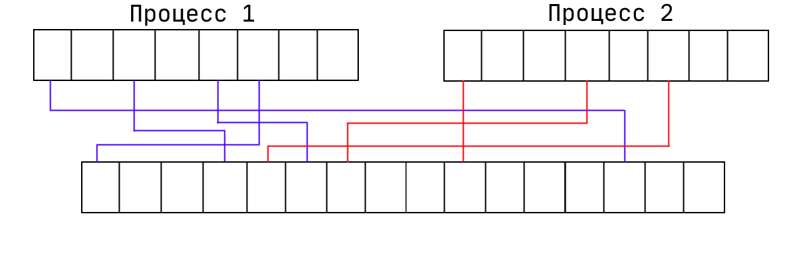
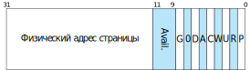
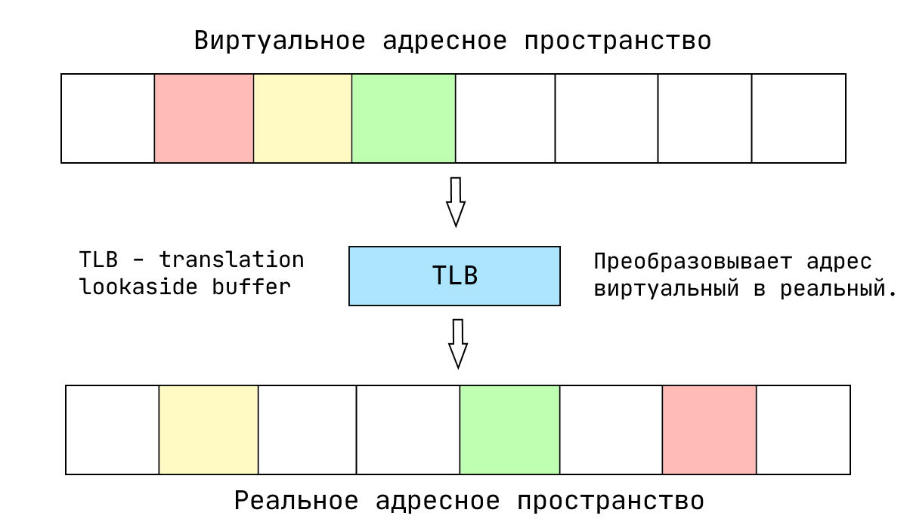
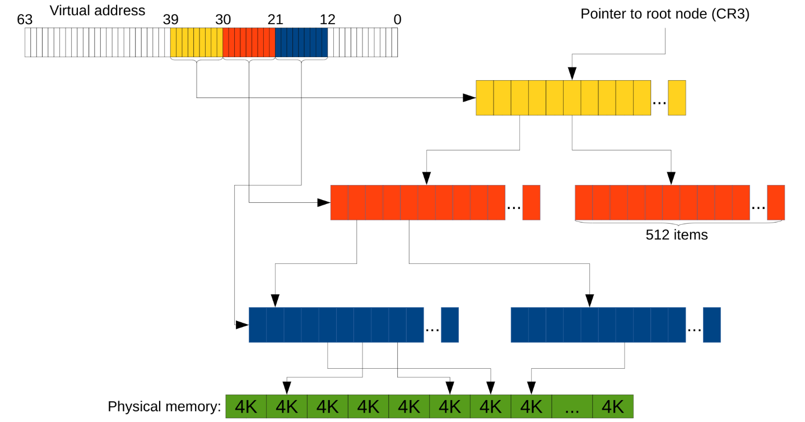
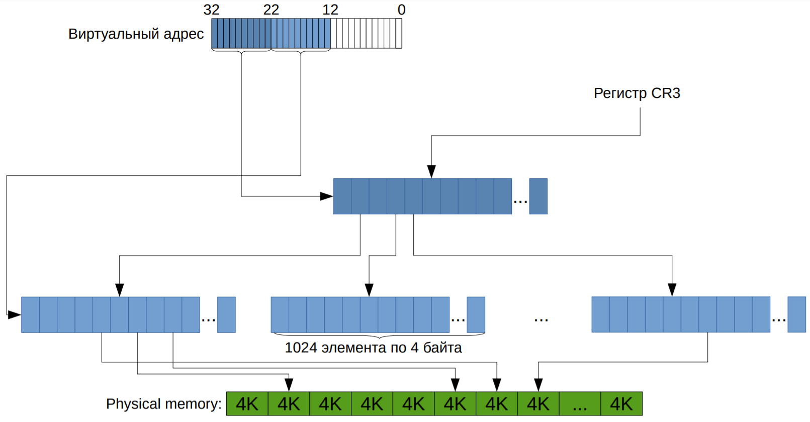

# ОС, процессор и память
- [Запись лекции №1](https://www.youtube.com/watch?v=bTgtesThdSg)
- [Запись лекции №2](https://www.youtube.com/watch?v=XY8xN1Ug1_k)
---
## Прерывания

Почему программа с вечным циклом не повесит нам весь компьютер, даже если у нас всего одно ядро? Как ОС работает с устройствами? Всё это завязано на *прерываниях*.

Изначально прерывания были созданы, чтобы устройства, которые, например, читают данные, сами оповещали процессор о том, что они дочитали, вместо того чтобы он постоянно их сам спрашивал. Есть два способа взаимодействия с устройствами:
- *Polling* — процессор сам опрашивает устройства, когда считает нужным.
- *Interrupt* (прерывание) — устройство само говорит об изменении, процессор вызывает обработчик прерываний.

С точки зрения программы это выглядит так: ОС её прерывает, выполняет что-то, после чего возобновляет выполнение там, где прервала. И сама заботится о том, чтобы программа не видела изменения регистров, например. То есть 
1) Значения регистров текущего процесса дампаются в оперативную память.
2) Подгружаются значения регистров другого процесса, и исполнение передаётся ему.

Такая схема называется *вытесняющей многозадачностью*.

Если вам хочется посмотреть на прерывания глазками, вам нужен файл */proc/interrupts*. Там вы можете посмотреть все типы прерываний с процессами и описаниями. Например, при нажатии на кнопку и отжатии кнопки на клавиатуре посылается специальное прерывание, с тачпадом то же самое и т.п. Сейчас нас интересуют два типа:
- *Local timer interrupt* — прерывания по таймеру, своё у каждого ядра ЦП. ОС заводит таймер, когда таймер срабатывает, провоцируется прерывание, и ОС получает управление в обработчике прерываний. На самом деле, всё сложнее, потому что постоянно работающие таймеры это неэкономно, поэтому он, например, отключается, если на ядре ничего не исполняется.
- *Rescheduling interrupts* — прерывания, использующиеся для перепланировки (миграции) процесса на другое ядро в целях распределения нагрузки. Реализованы с помощью [IPI](https://en.wikipedia.org/wiki/Inter-processor_interrupt).


## Работа программы с памятью
Что будет, если мы возьмём рандомное число, кастанём его в `char*`, после чего запишем по нему букву? Будет SEGFAULT. Что это такое вообще? Чтобы ответить на этот вопрос, надо понять, как в одной памяти живут программы. В процессоре есть механизм, который позволяет операционной системе делать две вещи:
- *Hardware abstraction* — программа не знает, что с точки зрения железа происходит. Например, мышка может быть подключена по-разному, но программе всё равно. В случае с памятью программа не знает, что происходит с её памятью, с её точки зрения вся память — её память.
- *Isolation process* — программа не может повлиять на другие программы (записать в их память). Если вы это специально не захотите, конечно.

Как конкретно это работает? В нашей прошлой модели память — пронумерованные ячейки. Мы будем называть *физической памятью* то, что у нас в жизни в оперативке (какие-то квадраты с какими-то открытиями/закрытиями строк). Этот уровень недоступен даже ядру ОС, максимум можно догадываться, что там. Вместо этого вы обращаетесь к памяти по другим адресам (*виртуальная память*), которые процессором преобразуются (*транслируются*) в физический адрес, по которому он и обращается. У вас нет способов этого избежать, максимум (если вы в ядре) — слабо повлиять. И суть в том, что пересчёт разный для разных программ, поэтому в разных программах одно и то же число адреса — разные ячейки физ. памяти. *Трансляция адресов* реализуется в специальном блоке процессора, называемом [MMU](https://en.wikipedia.org/wiki/Memory_management_unit).

**Дальше будет рассматриваться 32-битная система**, а потом будет сказано, чем 64-битная отличается.
### Страничная адресация
Это способ организации виртуальной памяти, при котором виртуальные адреса отображаются на физические постранично (**обычно 1 страница = 4 KB**). Процессор может настроить механизм так, чтобы произвольная страница виртуальной памяти транслировалась в произвольную физической. При этом память процесса может лежать в физической памяти в любом порядке:



В принципе, ОС ничего не мешает сделать две страницы виртуальной памяти и направить их в одну страницу физической. Работать это будет так, как вы думаете. Если делать это из разных программ, они смогут общаться. Ещё мы можем запрещать какие-то страницы (помечая их как отсутствующая). То есть считается, что эта страница никуда не транслируется. Именно поэтому и происходят SEGFAULT'ы. Соответственно, процессор даёт эту информацию ОС, а она даёт программе ошибку.

В 32-битных системах система страничной адресации основана на вот таких штуках:



Сначала адрес, затем разные флаги. Например, `R` — read only или нет. `W` — write through — про кеширование, прочие флаги содержат другие данные для ОС. В 64-битных системах имеем то же самое, но адрес побольше, и сама структура занимает 64 бита, а не 32.

Если подойти к хранению таких структур наивно, то получится набор страниц, для каждой храним 32-битное число. То есть имеем массив таких структурок. Это работает, но имеет одну проблему: в 32-битном режиме имеем 4ГБ памяти, то есть нужно 4МБ памяти на процесс. Это слишком много, особенно учитывая то, что в древности 4МБ — это типовой размер был. А в наше время в 64-битном режиме на одну программу понадобится 32ПБ. Поэтому заметили, что бо́льшая часть программ используют
меньше 4ГБ памяти. А значит бо́льшая часть страниц недоступна. Поэтому давайте вместо 1048576
элементов хранить табличку 1024×1024. То есть вместо массива на много элементов храним массив (*каталог страниц*) размера 1024 из указателей на массивы размерами по 1024 (*таблицы страниц*). И тогда мы можем сразу в каталоге пометить, что его элемент никуда не ссылается.

Это выглядит как-то так:

<!--  Это в нашем курсе было позже. -->
<!--  Это на x64 так выглядит. -->

<!-- Для ускорения трансляции применяется специальный кеш TLB (Translation lookaside buffer). `-->

`CR3` с картинки — специальный регистр, где хранится корень дерева. Подробнее можно прочитать [тут](https://wiki.osdev.org/Paging).

#### Механизм адресации на уровне процессора:
<u>Пример адреса</u>:
Virtual address - 0x123456789A

Младшие 12 бит виртуального адреса: смещение внутри страницы. Следующие 10 бит - индекс в таблице страниц, старшие 10 бит - индекс в каталоге страниц.  
```c++
typedef uint32_t page_table_element;
typedef uint32_t virtual_address;
struct page_directory
{
     uint32_t translate(virtual_address);
     private:
     	page_table_element data[1024];
};
```
Альтернатива известна лишь одна: *хеш-таблица*, но она плохо взаимодействует с кэшем. Использовалась в PowerPC.

#### Страничная адресация на 64-битной системе
Всё выше было про 32-битную архитектуру. На 64-битной
- Виртуальный адрес сильно больше (64 бита, собственно).
- Больше физической памяти.
- Размер «структурки» также удваивается, а значит структурок в
одном массиве теперь 512, а не 1024. То есть адрес мы уже делим на кусочки по 9 бит, а не по 10.

Но так даже с тремя уровнями вместо двух остаётся куча лишних байт (на адрес расходуется 39 бит, куда девать остальные — не понятно). В таком случае считается, что **«лишние» биты должны совпадать со старшим «не-лишним»**. Более современные процессоры поддерживают и 4 уровня в дереве (т.е. теперь адрес эффективно 48-битный), а новейшие Intel'ы — 5 уровней, что позволяет адресовать 128ПБ. Пример с тремя уровнями выглядит так:


Ещё связанные с этой темой такие технологии как TLB и Huge Pages, но это смотрите в ~~следующих сериях~~ следующем файле.
#### Нестандартные использования страничной адресации
1) Во-первых, есть *memory-mapped файлы*. Это просьба операционной системе загрузить файл с диска в ваше адресное пространство. Для программы при этом создаётся иллюзия, что она напрямую обращается в этот файл.
2) В некотором смысле антиподом memory-mapped файлов являются *файлы подкачки (swap)*. Ситуация тут обратная — есть вы хотите сожрать больше памяти, чем вам могут дать, то лишнюю память выгружают на диск, а при использовании подчитывают.
3) А ещё мы уже обсудили, что можно направить виртуальные адреса у двух разных программ в одну физическую страницу, чтобы реализовать базовое взаимодействие между ними. Это называется «*разделяемой памятью*». (Из более высокоуровневых технологий есть такая штука как *PIPE*.)

### Stack guard page

Стек &mdash; зарезервированный кусок памяти определённого размера. Как тогда проверять, что произошёл stack overflow? 

Может случиться, что сразу снизу заполненного стека (напомним, что стек увеличивается сверху вниз, то есть в сторону уменьшения адреса) лежит какой-то отмапленный файл. Тогда вызов `push x` не приведёт к ошибке &mdash; этот сегмент памяти же доступен, мы запишем что-то в этот файл и повредим его. Такие ситуации легли в основе уязвимости [Stack Clash](https://blog.qualys.com/vulnerabilities-threat-research/2017/06/19/the-stack-clash).

В Linux и Windows для предотвращения этого сразу снизу стека зарезервировали специальную страницу, называемую *stack guard page*. Теперь, если мы перешли за границу стека, то мы обращаемся к guard page, она недоступна и мы получаем SIGSEGV. Данные в безопасности! :)

Вот только не совсем. Stack guard page легко перепрыгнуть, достаточно сделать функцию с тысячами локальных переменных. 

В Linux эту проблему решили следующим образом &mdash; размер stack guard page просто увеличили до 1 мегабайта. Формально проблема осталась, но её уже гораздо сложнее воспроизвести.

В Windows решили воспользоваться тем, что страницы выделяются не сразу, а только после обращения к ним. Требуется, чтобы страницы стека page fault'ились подряд, иначе мы словим access violation. Теперь перепрыгнуть невозможно, ведь для этого нужно пропустить страницы, а это, в свою очередь, вызывает ошибку.
