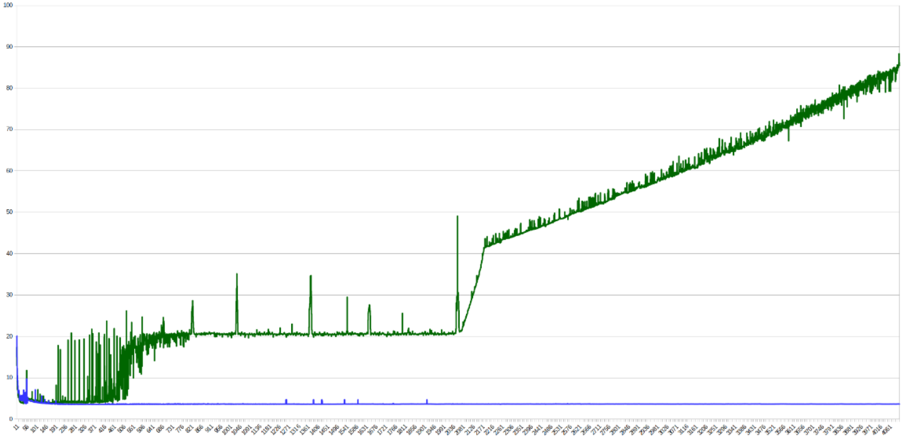
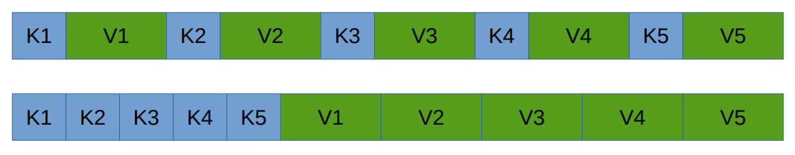
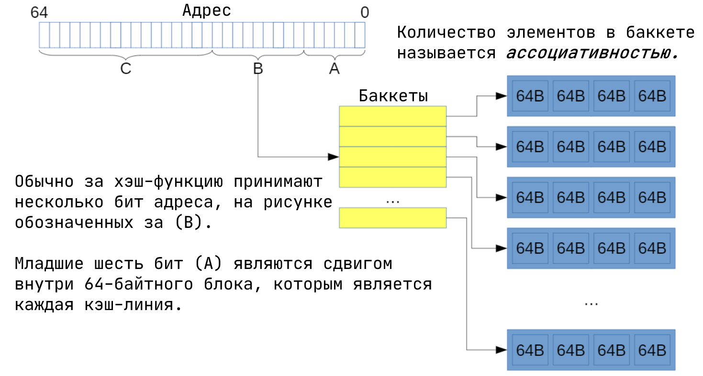
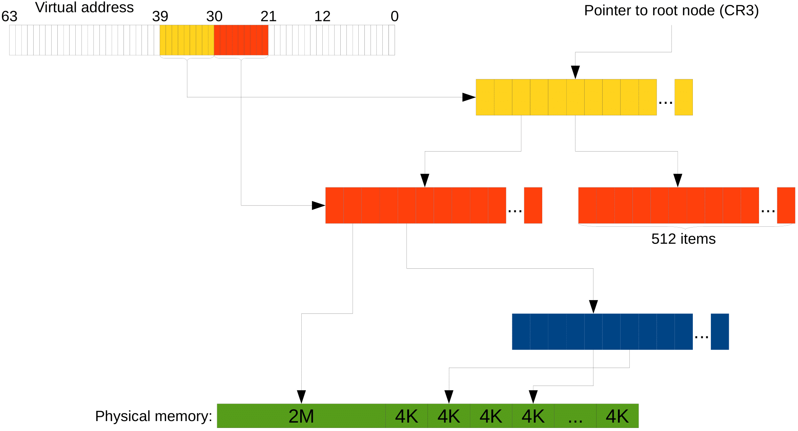
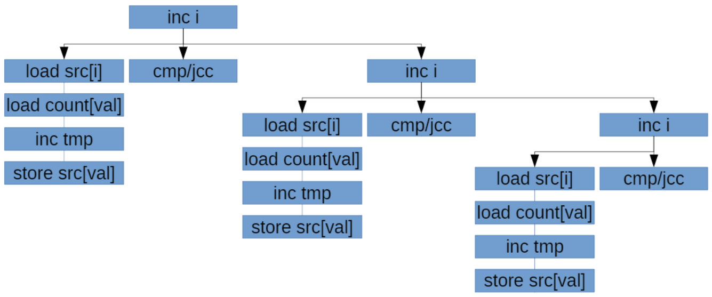

# Более точная (и оптимизированная) модель работы процессора.

- [Слайды с лекции](slides/lecture-3.pdf)
- [Запись лекции №1](https://www.youtube.com/watch?v=6vlNFxpSENs)
- [Запись лекции №2](https://www.youtube.com/watch?v=DddjrdCrCF8)
---
> Optimize for data first, then code. Memory access is probably going to be your biggest bottleneck.
---
Нам надо знать, как оптимизировать программы, а для этого надо понимать, какие операции в процессоре дешёвые, а какие — дорогие. Скорее всего, наш ассемблерный код, если переписать его в плюсы, а потом скомпилировать, заработает сильно быстрее.

Мы рассмотрим несколько примеров, которые в нашу текущую модель не укладываются вообще, разберёмся в них и уточним модель. При этом мы не стремимся получить максимальную детализацию. Во-первых, если у нас есть эффект, дающий нам $0.01\%$ прироста скорости, он нам не очень критичен. Во-вторых, чтобы анализировать и делать выводы, нам придётся нашу модель сделать проще. Физики вон, упрощают реальный мир, чтобы делать свои предсказания.

Сначала разберёмся, о каких процессорах мы будем говорить. Ответ — в каком-то смысле обо всех современных (последние 17 лет). Причём вне зависимости от архитектуры. И это не заговор разработчиков, просто в течение 40 лет все думали, как процессоры сделать быстрее и энергоэффективнее, и то, что оптимизации поддавалось, то оптимизировали. А то, что поддавалось оптимизации сложно, то оставалось медленным. Например, операция деления занимает много больше времени, чем, скажем, сложение. И это не потому, что разработчики процессоров дураки или лентяи, а потому что есть внутренняя сложность.

## Работа с памятью.
### Кэш-память.
Одинаково ли по времени будут работать следующие два кода?
```c++
for (i = 0; i < N; i++)         for (i = 0; i < N; i++)
	for (j = 0; j < N; j++)         for (j = 0; j < N; j++)
		a[i][j] = 0;                    a[j][i] = 0
```
А вот вообще нет. Разница во времени работы будет весьма ощутимой по вине процессорного кэша. Первый цикл обращается к памяти последовательно, а второй "скачет" по ней. Поэтому первый цикл как подгружает кэш-линию, так к ней и обращается, а второй — подгружает-выгружает. С ростом `N` видна разница между уровнями кэша на графике времени обработки одного элемента:



Небольшие пики - скачки из-за попадания в один бакет (заметно на степенях двойки), сильное изменение времени работы происходит, когда данные перестают попадать в кэш какого-то уровня.

*Кэш* реализован через хэш-таблицы (дискретного размера), где ключ - адрес в памяти. **Линии кэша обычно занимают 64 байта** и разделены на группы (*buckets*), размеры которых называются *ассоциативностью кэша*.

Зачем существует кэш вообще? Как мы знаем, согласно закону Мура, мощность процессоров от времени зависит экспоненциально. Так вот памяти — тоже. Но скорость памяти растёт сильно медленнее (сейчас процессор делает по 4 простые операции за такт, а обращение к памяти занимает 200+).


Это никуда вообще не годится, поэтому на процессорах появились кэши. Занимают они чуть ли не половину кристалла, и так было что в пентиумах, что во всех современных процессорах. Типовое время обращения к памяти — 4, 12, 36 и 230 тактов для L1, L2, L3 и RAM соответственно. Поэтому сначала надо оптимизировать данные, а уже потом код.

Подробнее про кэш можно прочитать в [конспектах по ЭВМ](https://github.com/DespairedController/computer-architecture/blob/master/1_4/1_4.pdf) или в [других конспектах по ЭВМ](https://www.overleaf.com/read/hcmjjqmhwqzx).

### Префетчинг.
*Prefetching* — это метод, при помощи которого заранее определяется, к каким областям памяти в будущем пойдут обращения. Если много кэш-промахов, заранее подгрузить в кэш запросы очень полезно. Кстати, работает это на уровне кэш-подсистемы процессора, а не компилятора/ОС.

Осуществляется префетчинг, например, при помощи улавливания последовательных обращений к памяти (если вы сначала обращаетесь к первой ячейке, а потом — ко второй, то можно заранее начать обращение к третьей, вдруг вы туда обратитесь). В современных процессорах есть аж целых 4 разных префетчера: два для L1 и по одному для L2 и L3. Идейно префетчинг позволяет тратить ресурсы процессора на то, чтобы ускорять память, что полезно всё по той же причине — память медленнее.

### Промежуточные выводы (best practices) касательно памяти.
- Иногда выгоднее будет что-то пересчитать, чем хранить всё в памяти (процессор быстрее же).
- Если вы знаете, в каком порядке вы будете обращаться к данным, важно правильно их положить (тоже последовательно).
- Хранить «горячие» и «холодные» данные нужно в разных местах. «Горячие» — это которые вам часто нужны, «холодные» — которые не очень. Почему в разных? Потому что иначе у вас в кэше будут лежать и «горячие», и «холодные» данные, вместо того, чтобы забить его «горячими» полностью.

<u>Пример</u>: Как правильно реализовать хранение хэш-таблицы с открытой адресацией. Два варианта: 


<!-- Что это, Берримор?! -->

А вот что лучше, зависит от hit rate'а нашей таблицы:
- Если мы часто находим значения, мы смотрим на ключ, и берём значение, которое рядом с ним, удобно.
- А если мы редко их находим, то мы ведь долго бежим чисто по ключам, а значит нам выгоднее будет сохранить их вместе.

## Работа с указателями.
### Indirection.
*Indirection (непрямое обращение к памяти)* — ситуация, в которой вы обращаетесь к чему-то по рандомному указателю. Понятно, что **непрямых обращений к памяти сто́ит избегать**, потому что это, здравствуйте, промах по кэшу. Вместо обращения по указателю можно просто заменить этот указатель на сами данные. С другой же стороны, **если у вас указатель на «холодные» данные есть в «горячих», то тупо вставлять эти данные внутрь сомнительно** — как уже было сказано «горячие» и «холодные» надо бы хранить в разных местах.

### Указатели в структурах данных.
Вы, возможно, не знали, но ваша программа процентов на 80 состоит из них. Так, `std::vector` — это три указателя, `std::list` — два указателя и одно число размером с указатель, `std::set` и `std::map` — один указатель и одно число. При этом указатели на x86-64 здоровые, 64 бита занимают. А ведь вам обычно не нужны 64-битные указатели, вам хватит и 32 бит, а значит памяти они занимают вдвое больше, чем могли бы. Поэтому Intel сделали *ABI x32*. Для ОС это выглядит как 64-битная программа, но внутри она имеет 32-битные указатели. Во всём остальном она ~~верблюд~~ x86-64. Конвенции вызова там точно такие же, вещественная арифметика — тоже, количество регистров — 15 целочисленных и 16 вещественных. Этот ABI не очень прижился, что довольно грустно.

Но что интересно, на целочисленных тестах x32 было на 5–8% быстрее, чем x86-64 (просто из-за того, что данных меньше), на floating-point данных разницы нет, а на одном специфичном бенчмарке (там просто куча указателей) ускорение достигало 40%. А в сравнении с x86, ускорение было соответственно в 7–10% и 5–11% для целых и floating-point тестах, а специфичный бенчмарк был с 64-битной арифметикой (и тоже имел 40% ускорение).

### Translation lookaside buffer.
Давайте вспомним про виртуальную память. Имея нашу древовидную структуру, на каждое обращение к памяти в программе нам придётся делать 4 (или 5, если уровней 4) обращения в память внутри процессора (чтобы пройтись по дереву). Это треш, поэтому **результат трансляции виртуальной памяти в физическую также кэшируется**. Буфер, в который кэшируется, называется *TLB (translation lookaside buffer)*. А это значит, что **если наша программа обращается к реально большому объёму памяти, то мы платим ещё и за трансляцию**, а не только за этот факт сам по себе.

### Huge pages.
Что ещё может улучшить неприятную ситуацию с трансляцией? Страницы по 4 KB достаточно маленькие, и заниматься администрированием их довольно накладно. Поэтому в процессоре есть механизм *Huge pages*, который позволяет нам на промежуточном уровнем дерева установить специальный бит, который говорит, что этот промежуточный элемент хранит не ссылку на следующий, а сразу страницу данных.



И тогда страница будет иметь размер 2 MB, если брать предпоследний уровень, или вообще 1 GB, если
третий снизу. Это экономит и время трансляции, и место в TLB.

**Но использовать Huge pages тяжело, так как с ними тяжело делать *swap (подкачку страниц)***. Например, в **Windows требуются специальные права, чтобы выделять не-swappable память**.

## Конвейер (Pipelining).

Ну тут опять всё [как было на ЭВМ](https://github.com/DespairedController/computer-architecture/blob/master/2_3-4/2_3-4.pdf): разбили выполнение команды на несколько стадий, теперь можем повысить частоту, так как каждая стадия стала проще. Выигрыш в том, что можем давать новые данные на каждом такте.

### Branch prediction.

*Спекулятивное исполнение*: условные переходы дорогие, поэтому мы предсказываем переход, выполняем, а если не угадали, то откатываемя. В общем, ничего нового. Также это называется *branch prediction*.
Можем как выиграть, так и проиграть от этого. Например, [в некоторых программах на отсортированном массиве](https://stackoverflow.com/questions/11227809/why-is-processing-a-sorted-array-faster-than-processing-an-unsorted-array) предсказание может улучшить время работы в несколько раз.

Касательно предсказаний, **процессор умеет предсказывать много различных паттернов**, поэтому искусственно составить что-то, что будет сложно предсказываться, довольно проблемно. Но это не единственное, что процессор умеет. Давайте рассмотрим генератор случайных битов, который называется *линейный регистр сдвига с обратной связью*. (Раз биты случайные, то предсказываться должно просто
отвратительно.) Он работает примерно так:
```c++
unsigned lfsr = 0xace1;
for (unsigned i = 0; i != 1000000000; i++)
{
      unsigned lsb = lfsr & 1;
      lfsr >>= 1;
      if (lsb)
            lfsr ^= 0xb400;
}
```
Видим здесь условный переход. Попытается его поправить двумя путями. Раз:
```c++
unsigned lfsr = 0xace1;
for (unsigned i = 0; i != 1000000000; i++)
{
      unsigned lsb = lfsr & 1;
      lfsr >>= 1;
      lfsr ^= 0xb400 * lsb;
}
```
Два:
```c++
unsigned lfsr = 0xace1;
for (unsigned i = 0; i != 1000000000; i++)
{
      unsigned lsb = lfsr & 1;
      lfsr >>= 1;
      lfsr ^= 0xb400 & -lsb;
}
```
Если сравнить время работы этих программ, то они будут отличаться так, как ожидается (первая самая долгая, третья — самая быстрая), но ненамного. Но вот если проанализировать программу какими-нибудь прошаренными средствами, то можно заметить, что неверные предсказания дают нам $0.01\%$ от всех предсказаний. То есть проблема не в условных переходах. А знаете, почему?

А потому что **в процессоре есть такие инструкции как `cmovne`**. Если скомпилировать первый вариант с оптимизациями, получим комбинацию из `test` и `cmovne`. Как несложно догадаться, последняя инструкция совершает присваивание в том случае, если не задан флаг ZF. Без условного перехода.

Хорошо, но всё же что будет, если правда сделать условный переход? Для этого компилятору надо дать ключи *-fno-if-conversion -fno-if-conversion2*, которые заставят его не использовать `cmovne`, и вот тогда уже всё замедлится намного сильнее.

### Спекулятивное взаимодействие с памятью.
Как мы знаем, компилятор (да и процессор тоже) любит переставлять инструкции между собой. Поэтому **полезно писать программу так, чтобы уровень зависимостей команд был как можно меньше**. Это может также пытаться делать компилятор, <u>например</u>:
```c++
int f(int a, int b, int c, int d)
{
 return a * b * c * d;
}
```
может скомпилиться в следующий код, чтоб уменьшить количество зависимых умножений: `(a * b) * (c * d)`
```nasm
 imul		edi, esi
 imul		edx, ecx
 imul		edx, edi
 mov		eax, edx
 ret
```
То же самое очень хочется делать с обращениями к памяти. По-хорошему, нельзя читать до того, как закончат выполняться записи, потому что в случае, если мы читаем то, что писали, хочется прочитать то, что записано, а не что-то левое. Но **процессор выполняет операции спекулятивно, в надежде на отсутствие коллизий**. Поэтому код:
 ```c++
void count_huffman_weights(char const* src, size_t size)
{
      uint32_t count[256] = {0};
      for (size_t i = 0; i != size; ++i)
          ++count[src[i]];
}
 ```
Будет работать тем быстрее, чем более разные данные в src (если данные одинаковые, процессор спекулятивно запускает несколько инкрементов за раз, потом понимает, что они инкрементят одно и то же и откатывает все, кроме одного; в результате не только простаивает superscalar, но и происходят
откаты туда-обратно). Вот как выглядит граф зависимостей в этом коде:



Чтобы это пофиксить, можем сделать 8 разных массивов-счетчиков. Такая реализация используется в библиотеке *Zstandart*:

```c++
void count_huffman_weights_improved(char const* src, size_t size)
{
      uint32_t count[8][256] = {};
      size = size / 8 * 8;
      for (size_t i = 0; i < size;)
      {
            ++count[0][src[i++]]; ++count[1][src[i++]];
            ++count[2][src[i++]]; ++count[3][src[i++]];
            ++count[4][src[i++]]; ++count[5][src[i++]];
            ++count[6][src[i++]]; ++count[7][src[i++]];
      }
}
```
-----------
## Полезные книжки по теме.
- J. Shen, M. Lipasti — Modern Processor Design: Fundamentals of Superscalar Processors.
- J. Hennessy, D. Patterson — Computer Architecture: A Quantitative Approach.

Они сильно выходят за рамки нашего курса, но тем не менее
интересны.
