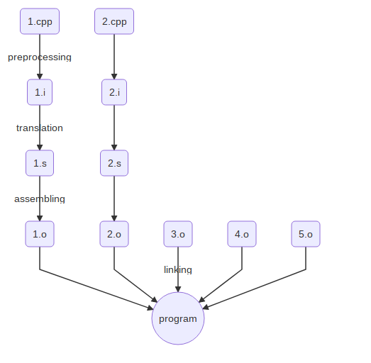

# Процесс компиляции программ
- [Запись лекции №1](https://www.youtube.com/watch?v=Fm-EmbQVrLE)
- [Запись лекции №2](https://www.youtube.com/watch?v=w0G66pR3JuY)
- [Запись лекции №3](https://www.youtube.com/watch?v=gsFYkmckcZs)
- [Практика](https://www.youtube.com/watch?v=jZAWVxcHLKA)
---


Классическая схема этапов компиляции. 
Есть [похожая статья на хабре](https://habr.com/ru/post/478124/).

**Preprocessing**
`g++ -E -P 1.cpp -o 1.i`

Выполняет директивы (`#define`, `#include` и другие).

`#include` - вставляет текст из указанного файла
`#define` - задает макрос

**Translation**
`g++ -S -masm=intel 1.i -o 1.s`

Трансляция кода в ассемблер.

**Assembling**
`g++ -C 1.s -o 1.o` (либо `as ...`)

Транслирует ассемблерный код в машинный код.

`*.o` - объектный файл

**Linking**
`g++ 1.o -o program` (либо `ld ...`)

Связывает все объектные файлы и библиотеки в один исполняемый файл.
После этого этапа можно запускать `./program`.

`*.cpp` файлы так же называют единицами трансляции

Пример линкования файликов:

```c++
// a.cpp:						
int main() {					
	f();						
}
// b.cpp:
#include<cstdio>
void f() {
	prinf("Hello world");
}
```
Это не скомпилится, так как на этапе до линковки компилятор не знает о существовании `f()` где то вне `a.cpp`, поэтому ее надо объявить:

```c++
// a.cpp:						
void f();					
int main() {		
	f();						
}
// b.cpp:
#include<cstdio>
void f() {
	prinf("Hello world");
}
```
Для линковки вместе`g++ a.o b.o`

- Функцию нужно объявлять до её вызова.
- Если в обеих программах есть main, то невозможно будет слинковать (какой main запускать?)
- В main можно не делать `return`, по умолчанию вернёт 0.
- Можно писать функцию на ассемблере и вызывать из `*.cpp` файла, потому что на этапе линковки нет разницы.
- Во всех единицах трансляции только одно определение.
- Функцию нужно объявлять до её использования. Если она описана ниже, то транслятор не увидит её и кинет ошибку.
### Некоторые ключевые слова
**`static`** - переменная или функция - "не предоставляется наружу", видна только в одной единице трансляции. При этом если в другой единице есть функция с такой же сигнатурой, но в текущей единице она `static`, то не будет проблемы с multiple definition, а в текущей единице трансляции выберется `static`. 

Для функций `void f();` это объявление (declaration), а `void f(){}` -- определение (definition).\
Для переменных немного иначе: \
**`int a`** - определение \
**`extern int a`** - объявление (означает, что переменная объявлена где-то снаружи).

Глобальные переменные инициализируются нулями при определении, в отличие от локальных.

Можно заметить, что при линковке нам не важно, откуда приходят функции, исходный код одной из единиц трансляций может быть сразу на ассемблере:
```c++
extern "C" uint32_t fibonacci(uint32_t n);
// определена, например, в .s файле, но должны выполняться calling conventions
```
**`extern "C" f`** - использовать СИшное имя функции. На имена функций можно посмотреть так: `nm a.o`, `nm -C a.o`.\
В Си имя функции выглядит как `f`, в C++ как `_Z1fd`, где `d` - типа аргумента, который она принимает (тут `double`).\
Это связано с тем, что в Си нет перегрузки функций, поэтому там имена функций не декорируются типами их аргументов. \
У функций с разными сигнатурами, но помеченных как `extern "C"`, после компиляции не будет информации об типах их аргументов, поэтому это даже слинкуется, но работать не будет (ну либо будет, но тут UB, так как, например, типы аргументов ожидаются разные).

 Возьмём теперь объявление `printf` из `cstdio` и вставим его вручную:
```c++
extern "C" int printf(const char*, ...);
int main() {
	printf("Hello, world!");
}
```
Такая программа тоже работает. Откуда берётся `printf`? Ответ кроется в том, что при компиляции командой `g++ -c b.cpp` вызывается команда линковки `ld` с ключом, из-за которого файл линкуется с объектными файлами из стандартной библиотеки. Если посмотреть, то можно заметить, что наш файл линкуется с несколькими другими 
объектными файлами, один из которых содержит функцию `_start` (это может быть файл `crt1.o`), которая вызывает `main`.

## Headers
`2.h` - файлы не участвующие в компиляции, в них пишут объявления функций. Не нужно делать  `#include file.cpp`, а в `.h` не нужно определять функции.

Зачем это нужно? Как сказано выше, во всех единицах трансляции может быть только одно определение функции, потому что иначе получим redefinition error, так как компилятор не сможет выбрать из нескольких определений функции одно. Поэтому делаем на все единицы трансляции одно определение в `.cpp` файле, в хедерах объявления. Теперь, когда мы будем инклудить хедеры в другие единицы трансляции, у нас будет в них появляться только объявление функций из хедера.

Структуры/классы пишем в `.h`. При этом их методы можно определять там же, потому что они воспринимаются компилятором как `inline`.

Посмотрим на то, как работает `#include`:
```c++
// x.h:
struct x {}; 
// y.h:
#include "x.h"
// z.h:
#include "x.h"

a.cpp:							
#include "y.h"		-->		struct x{};
#include "z.h"				struct x{}; //ошибка компиляции
```
Решение:
1. `#include "x.h"` не писать в хедерах, а только по необходимости в .cpp (не очень решение)
2. ```c++ 
	// x.h:
	#ifndef X_H
	#define X_H		// - макрос
	struct x{};
	#endif
	```
	Это решение называется **include guard**
	Тогда при `#include x.h` будет проверка, заинклудили ли его уже и не будет проблем.
3. Директива  `#pragma once` - стандарт не поддерживает, но поддерживают, кажется, все компиляторы. Эффект как у **include guard**, но проще писать и нет проблемы с тем, что можем еще где-то сделать лишний `#define X_H`

Если меняется *header*, то необходимо перекомпилировать все файлы, которые подключают его (даже не непосредственно), что может быть неприятно.
```c++
#define PI 3.14 
// препроцессор подставляет вместо PI 3.14
```
Макросы обычно пишут капсом

## Про структуры

Хотим две структуры в разных хедерах `a.h` и `b.h`. В структуре `a` указатель на структуру `b` и наоборот.  

```c++
// main.cpp:
#include "a.h"
#include "b.h"
```

Если в `a.h` инклудится `b.h` и наоборот, то получим ошибку во время компиляции. Как фиксить? 

Если нам не требуется знать, что находится внутри структуры, можно использовать **forward declaration**. Например, `a.h` будет выглядеть так:

```c++
struct b;
struct a {
	b* bb;
};
```

**Важно**: избегайте циклических инклудов, чаще всего это приводит к ошибкам.

Пока структуру не определили, структура - это **incomplete type**. Например, на момент объявление `struct b;` в коде выше, `b` - incomplete. 
Все, что можно с ними делать - это объявлять функции с их использованим и использовать указатель. 
Становятся полным типом после определения.

Бонусом с **forward declaration** получаем, что нужно меньше перекомпилировать, так как меньше инклудов.

А теперь такой пример:
```c++
// a.cpp
#include <iostream>
struct x {
	int a;
	// padding
	double b;
	int c;
	int d;
}
int main(){
	x xx = f();
	std::cout << xx.a << " " << xx.b << " " << xx.c << " " << xx.d << "\n";
}

// b.cpp
struct x {
	int a;
	int b;
	int c;
	int d;
	int e;
};

x f() {
	x result;
	result.a = 1;
	result.b = 2;
	result.c = 3;
	result.d = 4;
	result.e = 5;
}
```

Тут стоит вспомнить, что структуры при линковке не играют никакой роли, то есть линковщику всё равно, что у нас структура `x` определена в двух местах. Поэтому такая программа отлично скомпилируется и запустится, но есть одна проблема. В `b.cpp` определение функции `f` скомпилируется с учётом смещений в структуре, определённой в этой же единице трансляции, то есть будто там лежит 5 интов.

Поэтому следует придерживаться правила определять структуры один раз и не писать разные структуры с одним названием.


## Inline

Компилятор сам умеет подставлять тело функций, но только внутри одной единицы трансляции (так как на момент трансляции у него нет функций из других единиц). Проблему с тем, что у нас не может быть больше одного определения функции во всех единицах трансляции, решает следующий модификатор:

**`inline`** - *рекомендация* компилятору заинлайнить функцию (подставить её тело). Их нужно определять в хедере и инклудить во все единицы трансляции, где нужно их использовать. На самом деле, современные компиляторы почти всегда игнорируют изначальный смысл `inline`. У компиляторов есть свои эвристки (размер функции, насколько упростится код и т.д.), по которым он считает, насколько функцию выгодно подставить. Поэтому `inline` пользуются только из-за следующего свойства: для функции, помеченной `inline`, возможно повторное определение, линковщик в таком случае оставляет только одно, предполагая, что они все одинаковые.

Сейчас у компиляторов есть такая вещь, как *link time optimization* (ключ компиляции `-flto`). Компилятор не пытается генерить код на стадии трансляции, генерит там только внутренний промежуточный код, его же записывает в объектные файлы, а затем на стадии линковки инлайнит функции между единицами трансляции и генерит настоящий код. В таком случае линковка может занимать много времени, поэтому применяется при сборке с оптимизациями.

Если у `inline` функции несколько разных определений, то линковщик выберет произвольное из них (например, из первой единицы трансляции или вообще разные в разных местах), поэтому нельзя нарушать правило одинаковых определений для `inline` функций. 

Если нужно именно заинлайнить функцию, то есть нестандартизированные модификаторы типа `__forceinline`, однако даже они могут игнорироваться компилятором. Инлайнинг функции может снизить производительность, на эту тему можно послушать доклад [Антона Полухина на C++ Russia 2017](https://youtu.be/rJWSSWYL83U?t=1970).