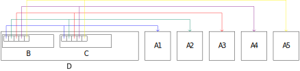

# Дисклеймер.
Год от года темы этого раздела тасуются как попало. Я попытался их разбить логически (так, чтобы всё, имеющее отношение к виртуальным функциям, не было разделено на части, например), так что не удивляйтесь, если в вашем курсе темы будут в другом порядке разложены.

# Наследование и виртуальные функции
- [Запись лекции №1](https://www.youtube.com/watch?v=IcAaaX888xc)
- [Запись лекции №2](https://www.youtube.com/watch?v=11MKhMYAmnE)
- [Запись лекции №3](https://www.youtube.com/watch?v=oMkF60mU8ig)
- [Запись лекции №4](https://www.youtube.com/watch?v=0-92_jC7YMU)
---
В курсе предполагается, что что-то о наследовании вы знаете и примерно представляете, что это такое. Оно было в курсе Java, и это первая причина, почему мы не будем обсуждать всё в мельчайших деталях. Вторая — потому что в книжках оно обсасывается очень подробно.

Про наследование сложно говорить в том же ключе, в котором мы говорили/будем говорить об исключениях, шаблонах и т.п. Исключения и шаблоны решают конкретные задачи, а для наследования таковой нет. Поэтому на эту тему мы будем смотреть иначе: есть механизм, а на кой он нужен?

## Lore.
Немного введения. Откуда идёт наследование? Если мы решаем задачу о моделировании дорожной сети, то первый порыв души — сопоставить объектам предметной области объекты нашей программы. Таким образом у нас очень естественно получается полиморфизм — у нас есть произвольные транспортные средства, которые очень похожи, а есть автобусы, трамваи и подобное, то есть более специализированные штуки.

Это не столько способ организации программы, сколько образ мысли. Причём полезный: мы можем начать декомпозировать задачу, даже не зная её решения. И, кстати, совсем необязательно объекту реальности сопоставлять объект программы, это может быть неэффективно — если мы решаем задачу о минимизации чего-то (за минимальные деньги перестроить дорогу так что...), то совершенно необязательно у вас будут такие же объекты.

А ещё бывает ситуация, когда вы придумываете движок регулярных выражений — никакие структуры из внешнего мира не приходят, вы делаете что-то, не имеющее отношения к реальности. И реальные программы где-то посередине: часть из реального мира, часть к нему не имеет отношения.

## Итак, наследование.
```c++
struct vehicle {
	std::string registration_number;
};
struct bus : vehicle {	// Наследуется от `vehicle`.
	int32_t route_number;
	std::string next_stop() const;
};
struct truck : vehicle {
	double cargo_mass;
};
int main() {
	bus b;
	vehicle& v = b;                // Можно делать так.
	v.registration_number = "123"; // Обращение к полям базового класса.
}
```
<!--
void f(vehicle& v){
	v.print_name(); // выведет vehicle, так как статический тип vehicle и при компиляции f подставляется вызов print_name от базового класса
}
Об этом чуть позже. есть.
-->
`bus` содержит и `route_number`, и `registration_number`.
Когда вы обращаетесь к какому-то полю или методу, компилятор сначала ищет его внутри вашего класса, а если не находит — идёт в базовый. Поэтому если у базового и наследуемого класса есть поле с одним именем, обращение к нему вернём поле последнего. Если наследоваться от двух классов (в C++ есть множественное наследование), и в двух базовых есть поле/метод с одинаковым названием, а в наследнике нет, то будет ошибка компиляции при обращении от объекта наследника.

Если поля классов совпадают в названии, то обратиться к полю другого можно так:
```c++
struct base {
	int xyz; // 1.
};
struct derived : base {
	int xyz; // 2.
};
int main() {
	derived d;
	d.xyz = 123; // Изменяется 2.
	((base&)d).xyz = 123; // Изменяется 1.
	d.base::xyz = 123; // Специальный синтаксис для изменения 1.
}
```
Как можно видеть из примера, класс можно приводить к любому его базовому по ссылке. Указатель на наследуемый класс можно приводить к указателю на базовый.

С методами в наследовании работают точно так же, как и с полями:

```c++
struct base {
	void g() {} // 1.
};
struct derived : base {
	void g() {} // 2.
};
int main() {
	derived d;
	d.g();       // Запуск 2.
	d.base::g(); // Запуск 1.
}
```
При создании объектов класса-наследника вызывается конструктор базового класса по умолчанию (в котором, если тот тоже от кого-то наследуется, вызывается конструктор его базы). Если нужно вызывать другой конструктор, используйте списки инициализации:
```c++
struct bus : vehicle {
	bus(std::string const& registration_number, std::string const& next_stop_name) 
		: vehicle(registration_number), next_stop_name(next_stop_name){}
};
```
При этом стандарт определяет следующий порядок инициализации ([перевод с cppreference](https://en.cppreference.com/w/cpp/language/constructor)):
- Инициализируются виртуальные базовые классы (про них будет [потом](#виртуальное-наследование)) в порядке обхода в глубину. Внутри одного класса инициализация баз происходит в том порядке, в котором вы их написали (слева направо).
- Инициализируются прямые базовые классы тоже слева направо.\
То есть если вы написали `class C : B, A`, то сначала инициализируется `B`, а потом — `A`.
- Инициализируются нестатические члены класса в порядке их объявления.

## Worst practices.
Во-первых, **не надо наследоваться, если вам нужно только расширить класс**. Если вы добавить новый функционал в `std::string`, не нужно от него наследоваться, а то ваш коллега тоже захочет по-другому её расширить, и вы получите два новых типа, а потом не сможете вызывать функции друг друга. Лучше создайте обычную функцию. Обычные функции — это хорошо, не надо писать всё классами.

Во-вторых, **не надо создавать отдельный класс под одну операцию**:
```c++
struct string_printer {
private:
	std::string msg;
public:
	string_printer(const std::string& msg)
		: msg(msg) {
	}
	void print() {
		std::cout << msg;
	}
};
```
Помимо того, что этот код и так выглядит как странное дизайнерское решение, у него есть вторая проблема — вот сделали вы `string_printer("Hello, world").print()`. А что если вы не сделаете `print`, или сделаете дважды? Потому что напечатать-то вы можете и в конструкторе, зачем вам метод? Не интуитивно.

Мораль: не заводите класс, если вам нужно сделать действие. Исключение — какие-нибудь компараторы, которые в общем случае могут быть полноценными классами, но вообще могут являться и обёрткой вокруг функции. И вот тут ничего не поделаешь, `std::map` принимает класс, а не функцию.

## Slicing.
<!--
Чаще всего для базового класса тяжело разумно определить копирование и присваивание, поэтому помечаем их `delete`:

Сомнительное утверждение. Да и не поэтому, а из-за явления, называемого *slicing*.
-->
А что будет, если вы забудете написать символ ссылки у наследуемого класса:
```c++
int main() {
	bus b;
	vehicle v = b;
}
```
А будет вот что. Ваш `bus b` будет неявно преобразован в `vehicle&`, после чего вызовется конструктор копирования. Подобное явление называется *slicing*, и зачастую (впрочем, не всегда) оно является не тем, что вам нужно. Чтобы таковое избежать, пометьте конструктор копирования и оператор присваивания базового класса как `= delete`.

## Виртуальные функции.
<!--
Когда без наследования не обойтись? Чаще всего его используют вместе с такими конструкциями, как виртуальные функции.

Честно говоря, обойтись, виртуальные функции не так и сложно руками пишутся.
-->

<!--
Реализованы они через так называемую таблицу виртуальных функций.

Воу-воу, спойлеры. Это потом.
-->
Виртуальные функции — главное (если не единственное), для чего вам нужно наследование.

Мы уже рассматривали код
```c++
struct vehicle {
	void print() {
		std::cout << "vehicle" << std::endl;
	}
};
struct bus : vehicle {
	void print() {
		std::cout << "bus" << std::endl;
	}
};
struct truck : vehicle {};

int main() {
	vehicle v;
	v.print(); // "vehicle".
	bus b;
	b.print(); // "bus".
	truck t;
	t.print(); // "vehicle".
}
```
При этом если мы напишем функцию
```c++
void foo(vehicle& v) {
	v.print();
}
```
То даже если передать в неё `bus`, она выведет `"vehicle"`. Думаю, никому не надо объяснять, почему. Потому введём пару определений, а после поясним, как поправить код.

*Статический тип* — это тип объекта, который в программе написан. И у всего, что приходит в функцию `foo` статический тип `vehicle` (вообще `vehicle&`, но не суть).\
*Динамический тип* — то, чем ваш объект был создан и по сути является. Так, ваш `vehicle` может являются `bus`'ом или `truck`'ом.

Так вот, **виртуальные функции позволяют выбирать метод исходя из динамического типа**, а не статического:
```c++
struct vehicle {
	virtual void print() {
		std::cout << "vehicle" << std::endl;
	}
};
struct bus : vehicle {
	void print() {
		std::cout << "bus" << std::endl;
	}
};
struct truck : vehicle {};

int main() {
	vehicle v;
	foo(v); // "vehicle"
	bus b;
	foo(b); // "bus"
	truck t;
	foo(t); // "vehicle"
}
```
Кстати, если у базового класса, функция виртуальная, то у производных тоже `virtual`.

Когда вы подобным образом подменяете виртуальную функцию, говорят, что `bus::print` *override*'ит `vehicle::print`.

### Виртуальный деструктор.
```c++
int main() {
	bus* b = new bus();
	vehicle* v = b;
	v->print();
	delete v;
}
```
Тут вызывается `v->~vehicle`. А если `bus` имеет какой-то нетривиальный деструктор, он не вызовется. Поэтому тут вам всё также надо вызывать деструктор в зависимости от динамического типа, а не статического.
```c++
struct vehicle {
	virtual ~vehicle() {}
};
```
С точки зрения языка, **вы не имеете права делать `delete` у базового класса, есть создали наследуемый и не пометили деструктор базового как `virtual`**. Если будете так делать — UB. [**Даже если все деструкторы тривиальные.**](#множественное-наследование)

### Виртуальные функции и параметры по умолчанию.
**Параметры по умолчанию являются частью декларации, поэтому соответствуют статическому типу**, даже если указать другие в наследнике:
```c++
#include <string>
#include <iostream>

struct vehicle {
	virtual void print_name(std::string prefix = "Base: "){
		std::cout << prefix << "vehicle" << std::endl;
	}
};
struct bus : vehicle {
	void print_name(std::string prefix = "Derived: "){
		std::cout << prefix << "bus" << std::endl;
	}
};
void foo(vehicle& t){
	t.print_name();
}
int main() {
	bus b;
	b.print_name(); // Derived: bus
	foo(b);	// Base: bus
}
```
### Как полиморфизм устроен изнутри.
Как бы мы сделали полиморфизм руками, если бы у нас его не было? Ну, через указатели на функции. По-другому не получится, потому что мы не знаем список всех наших
наследников:
```c++
struct base {
	base();
	void (*foo)(base*);
	void (*bar)(base*, int);
	void (*baz)(base*, double);
};
void foo_base(base* self) {
	// ...
}
void bar_base(base* self, int x) {
	// ...
}
void baz_base(base* self, double y) {
	// ...
}
base::base()
	: foo(foo_base), bar(bar_base), baz(baz_base) {}

struct derived : base {
	derived();
};
void foo_derived(base* self) {
	derived* derived_self = static_cast<derived*>(self);
	// ...
}
void bar_derived(base* self, int x) {
	derived* derived_self = static_cast<derived*>(self);
	// ...
}
void baz_derived(base* self, double y) {
	derived* derived_self = static_cast<derived*>(self);
	// ...
}
derived::derived()
	: foo(foo_derived), bar(bar_derived), baz(baz_derived) {}

int main() {
	derived d;
	d.bar(&d, 42);
}
```
Так в целом можно, но можно и чуть оптимальнее. У нас наши тройки функций не могут комбинироваться как им вздумается, всегда либо все из `base`, либо все из `derived`. И к тому же, нам не хочется с каждой новой функцией увеличивать размер структуры. Поэтому есть такая штука как *таблица виртуальных функций*. Это мы берём наши 3 указателя и выносим их в особый объект, указатель на который помещается в нашу структуру. А таких структур создать под каждый класс глобальными переменными. Это даёт нам ещё один indirection, но сокращает размер структур. И именно так это и работает во всех компиляторах. Во множественном наследовании у класса просто появляются две таблицы, под каждый базовый класс своя.

### Абстрактные методы (и классы):
Вот создали вы, скажем, устройство вывода. И отнаследовались из него, создав устройство, которое пишет в одно место, в другое место и т.д. Возникает вопрос: а что должно делать базовое устройство? Ну, непонятно. Ничего путного. Для этого есть механизм *чисто виртуальных* (*абстрактных*) функций — пометить, что этой функции не существует:
```c++
struct output_device {
	virtual void write(void const* data, size_t size) = 0;
};
struct speakers : output_device {};
struct twitch_stream : output_device {};
struct null_output : output_device {};
```
Чисто виртуальную функцию нельзя вызвать. И **нельзя создать класс, содержащий чисто виртуальную функцию**.

Но есть проблема:
```c++
struct base {
	base() {
		foo();
	}
	void foo() {
		bar();
	}
	virtual void bar() = 0;
};
struct derived : base {
	void bar() {};
};
```
Тут, когда вы создадите `derived`, вам на этапе исполнения скажут, что вы вызываете чисто виртуальную функцию. Почему?

А вот смотрите. Когда вы конструируете `derived`, сначала вызывается конструктор `base`, а только потом присваивается указатель на таблицу виртуальных функций. То есть **когда вызывается конструктор объекта, он не сразу с правильным динамическим типом, а изменяется по чуть-чуть**: сначала он базовый, а потом нормальный. Когда иерархия больше, динамический тип меняется большее количество раз.
Поэтому в конструкторе `base::base` `bar` — это функция без тела. 

А ещё этот пример не компилируется без прослойки вида `foo`. Почему так? А вот смотрите. Никто вам не мешает вызвать виртуальную функцию напрямую (обращения к таблице) так: `base::foo`. А если вы вызываете функцию в конструкторе и деструкторе, то вы точно знаете, ваш динамический тип. Поэтому, написав код
```c++
struct base {
	base() {
		bar();
	}
	virtual void bar() = 0;
};
struct derived : base {
	void bar() {};
};
```
Вы получите ошибку компиляции, потому что в `base::base` происходит вызов `base::bar`, а не просто `bar`, а значит мы явно вызываем виртуальную функцию.

## Множественное наследование.
Начнём с того, почему некорректно делать `delete` указателю на базовый класс, если все деструкторы тривиальные, но не виртуальные:
```c++
struct base1 {
	int x;
};
struct base2 {
	int y;
};
struct derived : base1, base2 {};
int main() {
	derived* d = new derived;
	base2* b2 = d;
	delete b2;
}
```
Потому что первый базовый класс лежит по тому же адресу, что и оригинальный класс, а второй — со смещением. Поэтому его удалить нельзя, вы освобождаете память не по тому
указателю. А виртуальный деструктор вас спасёт.

Ещё про множественное наследование нужно сказать вот что:
```c++
struct base2;
struct derived;

base2& to_base2(derived& d) {
	return (base2&)d;
}
struct base1 {
	int x;
	base1(int x) : x(x) {}
};
struct base2 {
	int y;
	base2(int y) : y(y) {}
};
struct derived : base1, base2
{
	derived(int x, int y)
		: base1(x), base2(y) {}
};

int main() {
	derived d(1, 2);
	std::cout << to_base2(d).y << std::endl; // Выводится 1.
}
```
Почему? А вот почему. Когда мы пишем `to_base2`, мы ещё не знаем, что один класс наследуется от другого, причём так, что ещё и указатели надо двигать. Он будет их двигать, если написать `to_base2` после классов, а так нет. Поэтому в C++ не надо использовать каст из C, вместо него есть 4 новых.

## Приведение типов (cast).
Пример выше правится так:
```c++
base2& to_base2(derived& d) {
	return static_cast<base2&>(d);
}
```
Если это будет написано в том же месте, то словим ошибку компиляции, а если после определения `derived`, то проблем не будет.

Итак, `cast`'ы:
- `static_cast` — то, что нам нужно в $99\%$ случаев. Кастует
	- Числа друг в друга.
	- Ссылки и указатели по иерархии наследования в любую сторону.
	- `void*` в любой указатель и обратно.

	При этом, понятно, кастовать `void*` куда-то корректно, если там изначально было то, куда вы кастуете.
	
	Аналогично, *вниз по иерархии* (от базового к наследуемому) можно кастовать только тогда, когда совпадает динамический тип. Иначе UB.
- `reinterpret_cast` — всё зашкварное из C-style cast'а. Перевод указателей несвязанных друг с другом типов, указателей в число и обратно. Простой и эффективный способ получить UB. В стандарте так и написано, это implementation-defined cast. Обратитесь к поставщику вашего компилятора, чтобы понять, как у вас работает `reinterpret_cast`.
- `const_cast`. Снимает модификаторы `const` и `volatile`. Чаще всего это делать не надо, но иногда бывает нужно всё-таки. В стародавние времена, когда `const`'ов не было, были функции, принимавшие указатель. Неконстантный, хотя не меняли его содержимое. И вот если вы хотите использовать эту функцию, вы можете снять `const` с указателя. А вообще правило вот какое: **если изначальный объект был `const`, снимать с него `const` ни в коем случае нельзя (UB). Если изначальный объект константным не был, а потом вы сначала навесили `const`, а потом сняли, то всё хорошо**.
- `dynamic_cast`. Немного другое, нежели все остальные касты. Работает для указателей и ссылок **на полиморфные (хотя бы одна виртуальная функция) типы**. Кастует по иерархии вниз (это, напомню, от базового к наследуемому), но, в отличие от `static_cast`'а, проверяет, что преобразование корректно. Если некорректно, возвращает `nullptr` в случае
указателей, кидает [исключение](./09_exceptions.md) `std::bad_cast` в случае ссылок. Работает это при помощи RTTI:

### RTTI. `typeid`.
А таблицах виртуальных функций может хранится нечто другое, не только указатели на функции. В частности, в них хранится такая штука как *RTTI* — *runtime type information*. Это какая-то информация, которую компилятор вставляет в таблицу, чтобы понимать динамический тип. И к ней даже можно доступ получить. Для этого есть ключевое слово `typeid`. Вы даёте ему объект, а он возвращает вам `std::type_info const&`, который по сути и является RTTI.

Кстати, в большинстве компиляторов можно выключать RTTI (в GCC — ключ *-fno-rtti*), чтобы не тратить место в бинарном файле. И в каких-то кодовых базах можно увидеть код без `dynamic_cast`'ов и `typeid`.

<!--
*В коде редко используют `dynamic_cast`, потому что чаще всего можно обойтись без него и ещё это может быть дорого*

Я бы не был так категоричен. В 2021–22 это было сказано в формулировке выше: *существуют кодовые базы*.
-->

## Парочка полезных ключевых слов.
### `final`.
final — нельзя наследовать. Либо нельзя наследовать класс, либо больше нельзя больше override'ить виртуальную функцию. Пишется так:
```c++
struct inderriveable final {
	// ...
};
struct error1 : inderriveable {} // A `final` class cannot be used as a base class.

struct base {
	virtual void foo() {}
};
struct derived : base {
	void foo() final {}
};
struct error2 : derived {
	void foo() {} // Cannot override `final` function `derived::foo`.
}
```
### `override`.
Явно указать, что вы override'ите виртуальную функцию, а не пишете что-то своё. Очень советуется это писать. Если кто-то изменит базовый класс, вы хотите явно видеть, что все функции
поломаются. Пишется в том же месте, где и `final`.

### `protected`.
Представим, что мы пишем виджет на основе QT. Там есть базовый виджет, у которого есть операции, что делать в случае нажатия мышки, в случае перемещения колёсика и прочее подобное. Вам всё это нужно переопределить. В таком случае в базовом виджете используется ключевое слово `protected`. Оно для похожих случаев и было создано, лол. Это модификатор доступа, дающий доступ только дочерним классам и себе.

С ним, правда, есть вопрос. Если метод не ломает инвариант, почему он не `public`, а если ломает, то хотим ли мы давать доступ дочерним классам. Тем не менее, эти вопросы не риторические, если вы нашли на них ответ — делайте `protected`.

## Ещё best practices.
Давайте дополним наш пример с виджетами выше. Вот есть у нас виджет, который знает, как его красить. И это виртуальная функция. Мы наследуется, меняем функцию, всё хорошо. Но есть же второй вариант — **создать отдельный класс, который отвечает за покраску, наследовать только его, и передавать этот объект в конструктор виджета**. Это может быть очень полезно, если мы хотим, например, одинаково красить разные классы в разных местах. Более того, мы можем **собирать наш виджет из кусочков**. В QT, например, используется оба подхода. Реакция на мышку, на клавиатуру, перекраска и некоторые другие штуки обычно очень сильно связаны с самим классом, а какая-нибудь стилизация — уже что-то внешнее.

Однако надо понимать, что комбинируя кусочки, можно зайти так далеко, что вы будете складывать $2+2$, получая двойку из какого-то `data_provider`'а, складывая каким-нибудь классом `adder` и подобное. Не надо плодить фабрики непонятных классов. Когда вы делаете точку настройки, вы делаете ставку на то, что будете менять. Тут надо сильно думать. Более того, **если вы сделали какие-то точки настройки, а расширять надо в другую сторону, то ваши точки настройки будут вам во вред**, потому что вам надо будет их с новыми согласовывать.

Мораль: **когда вы делайте фабрики/точки настройки/всё остальное, думайте, для чего вы это делаете**.

### Мем про квадрат и прямоугольник.

Как правильно наследоваться: квадрат от прямоугольника или прямоугольника от квадрата? (Для более детального понимания проблемы — смотрите [лекцию по Java](https://youtube.com/watch?v=RYuUybAh0SI&t=1772).)

Это зависит от того, что требуется от интерфейса. Давайте посмотрим, что требуется от этих фигур:
|  Квадрат |Прямоугольник|     Оба    |
|:--------:|:-----------:|:----------:|
|`get_side`| `set_width` | `get_width`|
|          | `set_height`|`get_height`|
|          |             | `set_side` |

Если нам нужно всё из этого, то отнаследовать какую бы то ни было фигуру от другой не получится. Но если у нас нет `set_*`, то методы, специфичные для прямоугольника, резко пропадают, а значит его можно отнаследовать от квадрата.

## Наследование против `union`'а.
Мы же можем использовать наследование для той же цели, что и `union`/`std::variant` — выбирать из альтернативы. В случае с `std::variant` мы даже можем проверять корректность обращения. Что же лучше?
|Преимущества наследования|Преимущества `union`'а|
|-------|-------|
|Если альтернативы разного размера, то `union` жрёт много памяти.|Наследование работает по указателю, а это даёт лишнюю индирекцию.|
|Можно легко добавить новую альтернативу.|Можно легко добавить новую операцию.|

## Модификаторы доступа наследования.
Как и у полей, у базовых классов можно указывать такие штуки как `class A : public B`. Причём в случае приватного наследования, вы не только поля из `B` не будете видеть в `A` извне, у вас даже `static_cast` не сработает. То есть **наследование с модификаторами доступа скрывает/показывает сам факт наследования**.

С какой целью это можно использовать — смотрите далее.
<!--
```c++
struct output_device {
	virtual void write(void const* data, size_t size) = 0;
	virtual void set_volume(double val) = 0;
	virtual void write(void const* data, size_t size) = 0;
};
struct volume_data : output_device {
	void set_volume(double val) override {
		volume = val;
	}
	double get_volume() override {
		return volume;
	}
private:
	double volume;
}
struct file : volume_data {};
struct speakers : volume_data {};
```

В коде выше можно приводить `file` и `speakers` к `volume_data` или использовать указатели на них как указатели на `volume_data`, чего мы не хотим.

Какой-то очень сомнительный пример, слушайте. Почему не хотим?
-->

## Виртуальное наследование.
```c++
struct A {
	int x;
};
struct B : A {};
struct C : A {};
struct D : B, C {};

int main() {
	D d;
	d.x = 7; // Не работает, x is ambiguous.
	d.B::x = 7; // Работает.
	d.C::x = 7; // Работает.
}
```
Если две копии `A` (а, следовательно, `x`) — это то, что вы хотите, то хорошо. А иначе есть виртуальное наследование:
```c++
struct A {
	int x;
};
struct B : virtual A {};
struct C : virtual A {};
struct D : B, C {};

int main() {
	D d;
	d.x = 7;
}
```

Если базовый класс помечен `virtual`, то это значит, что он шарится с другими такими же виртуальными классами в иерархии. Для иерархии все `virtual` базы склеиваются в один *подобъект* (*subobject*).

С методами это, кстати, работает точно также. Казалось бы, в чём проблема тут:
```c++
struct A {
	void foo();
};
struct B : A {};
struct C : A {};
struct D : B, C {};
```
Ведь метод и вас по-любому один, зачем тут виртуальное наследование? А нифига, в этот метод надо передать `this` типа `A* const`, а таких у вас два, непонятно, какой брать. Поэтому тут тоже нужно виртуальное наследование.

Теперь посмотрим на вот такой пример:
```c++
struct A {
	virtual void foo() = 0;
};
struct B : A {
	void foo() override {}
};
struct C : A {};
struct D : B, C {};
int main() {
	D d;
}
```
Тут понятно, в чём проблема. У `D` есть два подобъекта типа `A`, в одном из которых никто не за'override'ил `foo`. Значит `D` виртуальный класс. Значит его нельзя создать.

Это правится так:
```c++
struct A {
	virtual void foo() = 0;
};
struct B : A {
	void foo() override {}
};
struct C : A {
	void foo() override {}
};
struct D : B, C {};
int main() {
D d;
}
```
И так тоже правится:
```c++
struct A {
	virtual void foo() = 0;
};
struct B : virtual A {
	void foo() override {}
};
struct C : virtual A {};
struct D : B, C {};
```
Подобъект типа `A` у нас один, и его чисто виртуальная функция переопределена. Значит всё хорошо.
```c++
struct A {
	virtual void foo() = 0;
};
struct B : virtual A {
	void foo() override {}
};
struct C : virtual A {
	void foo() override {}
};
struct D : B, C {};
int main() {
	D d;
	d.foo();
}
```
А так, понятно, нельзя, потому что у одного подобъекта мы два раза за'override'или одну и ту же функцию. И фиг знает, что использовать. Только если вы за'override'иде эту же функцию прямо в `D`, то будет понятно, что использовать, и компилироваться исправно будет.

Описанным выше образом, кстати, работают вообще любые объекты одного имени. Т.е. переменные и обычные методы взаимодействуют с виртуальным наследованием также:
```c++
struct A {
	int x;
};
struct B : virtual A {
	int x;
};
struct C : virtual A {};
struct D : B, C {};
```
У вас будет две переменных `x`, в `D` по умолчанию будет использоваться `B::x`.

### Применение виртуального наследования.
С помощью виртуального наследования можно реализовывать интерфейсы по чуть-чуть. У нас есть абстрактный базовый класс, который умеет, там, рендериться, изменяться, что-то ещё делать, и мы можем override'ить одну его часть в одном классе, другую — в другом. А для сборки этих штук в одну придётся использовать виртуальное наследование:
```c++
struct game_object {
	virtual void render() = 0;
	virtual void update() = 0;
};
struct billbord_object : virtual game_object {
	void render() override {/* ... */};
};
struct static_object : virtual game_object {
	void update() override {/* ... */};
};
struct static_billboard : billbord_object, static_object
{};
```
Но это ещё цветочки, на самом деле. Представьте, что у вас есть какой-то публичный базовый класс (например, `widget_painter`), и вы создаёте несколько **похожих** его наследников. А потом видите, что наследники похожи, их можно обобщить, и получить какую-то такую иерархию:
```c++
// Somewhere.h
struct widget_painter {
	virtual void paint() {/* ... */}
};
```
```c++
// Your_file.h
struct my_base_painter : widget_painter {
	void paint() override {/* ... */}
};
struct my_painter1 : my_base_painter {};
struct my_painter2 : my_base_painter {};
```
Но мы не хотим, чтобы кто-то приводил наши классы `my_painter*` к `my_base_painter`, это деталь реализации. Поэтому хочется написать
```c++
struct my_painter1 : private my_base_painter {};
```
Но это не сработает, потому что тогда никто снаружи и наследование от `widget_painter` видеть не будет. Поэтому вот как надо:
```c++
//  Вот сюда смотреть:   vvvvvvv
struct my_base_painter : virtual widget_painter {
	void paint() override {/* ... */}
};
//  И сюда смотреть: vvvvvvv                  vvvvvvv
struct my_painter1 : private my_base_painter, virtual widget_painter {};
struct my_painter2 : private my_base_painter, virtual widget_painter {};
```

Мораль: **не надо бояться виртуального наследования и пренебрегать им**.

### Виртуальное наследование изнутри.
Во что бы мы оттранслировали виртуальное наследование? Давайте вместо того, чтобы внутри объекта B хранить объект A, хранить указатель на него. Но если у нас много виртуальных баз, то хочется табличку. А табличку указателей на базы нельзя, у всех объектов типа `D` эти указатели свои, в отличие от виртуальных методов.

Давайте хранить не указатель, а смещение до нужной виртуальной базы. И тогда в каждом объекте всё одинаковое, а значит можно объединить в табличку — табличку виртуальных баз.



А теперь ~~пример~~ мемы:
```c++
struct base {};
struct derived : virtual base {};
derived& test(base& b) {
	return static_cast<derived&>(b);
}
```
Так вот это не компилируется, потому что мы совершенно не шарим, откуда в объекте `b` взять смещение, которое хранится в `derived`. Но зато можно так:
```c++
struct base {
	virtual ~base() {}
};
struct derived : virtual base {};
derived& test(base& b) {
	return dynamic_cast<derived&>(b);
}
```
Это, как ни странно, компилируется, потому что вы можете взять RTTI из `b`, понять, что это `derived`, и украсть смещение из таблицы виртуальных баз для него. Более того, с `dynamic_cast` есть ещё больший мем:
```c++
struct A {
virtual void foo() {}
};
struct B {};
B& test(A& a) {
	return dynamic_cast<B&>(a);
}
```
Как ни странно, это компилируется, более того, даже может быть корректно, если вы создадите класс
`C` и отнаследуете его и от `A`, и от `B`.
