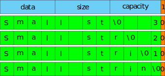

# Механизмы ОС для аллокации памяти, аллокаторы памяти, small-object и copy-on-write оптимизации.
- [Запись лекции №1](https://www.youtube.com/watch?v=oDPaXS9tKlw)
- [Запись лекции №2](https://www.youtube.com/watch?v=i8uYAe0E4PU)
---
— *Первую часть лекции лучше смотреть запись, так как там много профилирования и я не хочу вставлять это в конспект*\
— Я хочу. И вставлю в отдельный файл.

## Аллокация памяти на Linux.
На Linux страницы памяти выделяются через [`mmap`](http://man7.org/linux/man-pages/man2/mmap.2.html), а освобождают через `munmap`. Можно заметить интересный эффект: если мы просто делаем выделение памяти кучу раз, это будет относительно быстро, а когда мы начнём к выделенной памяти обращаться, ты мы зависнем надолго. Почему так? Точнее на вопрос «почему» ответ простой — потому что **ОС даёт нам память только тогда, когда мы её используем**, а вот «зачем» — интересный вопрос. Дело в том, что обычно у нас нет свободной оперативной памяти, она вся либо отдана другим программам, либо используется как дисковый кэш. Поэтому когда кто-то просит память, вам придётся сбрасывать дисковый кэш, либо выгружать кого-то в swap-файлы. А если вдруг ваша программа будет использовать выделенную память как-то потом (или не будет вообще), то давать ей память сразу невыгодно, поэтому ОС даёт её при обращении и маленькими кусочками (ведь используете вы маленькими кусочками, а `mmap` выделяет сразу кучу памяти). Кстати, **в `mmap` есть специальный флаг (`MAP_POPULATE`), который заставляет выделять память сразу**.

При этом, если сделать так, то работать это будет быстрее, чем если выделить память обычным образом, а потом к ней пообращаться, потому что с флагом не будет происходить множество переходов между userspace'ос и ОС при каждом обращении. Хорошо, а знаете ли вы, что **в `mmap` больше всего времени занимает обнуление выделенной страницы**. Зачем? А вдруг там кто-то криптографию оставил. Кто-то, кого вы только что убили, например. Но вообще под это тоже есть специальный флажок `MAP_UNINITIALIZED` (но только для анонимных страниц), который был создан специально для миниатюрных устройств. **Работает `MAP_UNINITIALIZED`, правда, только в том случае, если ОС была собрана специальным образом**. Если, кстати, делать `mmap` без флага `MAP_POPULATE`, то ещё больше времени, чем на зануление, будет тратиться на передачу обращения между ОС и userspace'ом.

Как подобное ленивое выделение работает с точки зрения страничной адресации? Вот так: при запросе выделения памяти через `mmap` ОС не сразу обращается к процессору, а помечает у себя страницы как "*заказанные*". Затем, когда происходит обращение к памяти, получаем ошибку *page fault*, ОС проверяет, если страница выделена, что она мапит её в физическую память, иначе это ошибка.

Как этим можно пользоваться? Типовое использование — это не выделение одной страницы, а сразу порции памяти, которая разбивается на мелкие куски и выдается `malloc`'ом. Когда они выдаются в программе, они мапаются в физическую память. Ещё мапить сразу в физическую память не очень полезно, так как память, не принадлежащая программой, используется ОС, например, как дисковый кэш.

Зачем нам это знать? Это полезно, если мы что-то бенчмаркаем и выделяем большой массив, первый прогон какого-нибудь алгоритма может быть дольше остальных из-за 
того, что он сначала не помаплен в память.

## Реализация `malloc` и `free`.
Давайте вот над чем подумаем. Нам же никто не мешает самим написать обёртку над `mmap` и `munmap`, чтобы у нас были свои `malloc` и `free`? Возьмём наивнейшую реализацию — `malloc` просто вызывает `mmap` (с некоторыми проверками).\
Если провести эксперимент, можно увидеть, что такая реализация будет капец медленной. Более того, она и памяти будет есть в 15 раз больше, чем стандартные `malloc` и `free`. Если протестировать стандартный `malloc`, то получим, что за одну секунду мы можем сделать 45000000 `malloc`'ов и `free`, но 200000 `mmap`'ов и `munmap`'ов.

Следовательно стандартные аллокаторы делают что-то умное. Если посмотреть на то, что именно, то выяснится, что у них **разные правила для больших и маленьких объектов**. Причём **с маленькими объектами все взаимодействуют одинаково**, а с большими — по-разному. Почему? Потому что $99\%$ аллокаций — аллокации маленьких кусочков памяти. И для таких ситуаций уже придумали, как оптимально жить. Большинство аллокаторов сейчас используют дизайн, заимствованный у аллокатора [Hoard](http://hoard.org/). Рассмотрим один из частых способов работы с маленькими объектами:

Современные аллокаторы умеют выделять их за $\mathrm O(1)$. Добиваются этого следующим образом: для каждого из частых размеров ($16$, $24$, $32$, ...) создают отдельные аллокаторы. Как делать аллокатор для маленьких объектов одного размера эффективно? У нас есть большой кусок данных и нам надо где-то хранить, какие его части заняты, а какие — свободны. И уметь быстро доставать случайный свободный и быстро освобождать. Простейшая структура, которая позволяет это делать — **односвязный список: список хранит незанятые данные, причём именно в этих данных и хранится указатель на следующий свободный кусок**.\
И это в целом рабочая идея. Именно что идея, потому что нужно уметь возвращать данные операционной системе, а со списком это сложно.

## SO и CoW оптимизации.

### Copy-on-write.
Вспомним класс `my_string` из прошлых лекций. У строки был какой-то буфер `data`, которым может заниматься достаточно много. Хотим при копировании сэкономить в случае, если после копирования не нужно изменять данные. Идея такая: когда делаем копию, копируем не данные, а просто указатель на них. При попытке модифицировать их, если буфер расшарен между несколькими `my_string`-ми, делаем копию данных.

Обычно это реализуется так: вместе с `data` храним счётчик объектов (`ref_counter`), у которых этот буфер общий. Если при попытке модификации `ref_counter > 1`, то нужно сделать копию.

```c++
struct buffer {
	size_t ref_counter;
	char chars[];
}

static buffer* allocate_buffer(size_t capacity) {
	return reinterpret_cast<buffer*>(
		operator new(
			sizeof(buffer) + (capacity + 1) * sizeof(char)
		)
	);
}
```
Тут можно заметить такую штуку как `char chars[]`. Это нестандартное расширение [flexible array member](https://youtube.com/watch?v=IAdLwUXRUvg&t=898s). Вместо него при большом желании можно просто указатель использовать, но FAM экономит нам одну индирекцию.

Во всех методах класса нужно обработать счетчик ссылок (опустим этот момент) и функцию `unshare`:
```c++
void my_string::unshare() {
	buffer* new_data = allocate_buffer(size_ + 1);
	memcpy(new_data->chars, data_->chars, size);
  
	--data_->ref_counter;
	assert(data->ref_counter != 0);
}
```
Можно заметить, что `capacity` и `size` строки можно перенести тоже в буфер.

После GCC5 отказались от использования CoW в строчках. Первая причина - заморочки с многопоточностью, вторая - оптимизация помогает на длинных строчках, но на небольших скопировать явно может быть даже дешевле. Для маленьких строк используют:

### Small-object.
<!---
Какой-то очень странный абзац, все выглядит сильно перепутанным
-->
Заметим, что мы хранили в буфере указатель на `size`, `capacity` и `data`, получаются накладные расходы в размере строки в $\approx20$ символов. Что сделали в GCC: добили строчку до 32 байт, а затем `data` и `size` остаются собой, а в остальном храним либо сами данные (`data` указывает туда, где лежало `capacity`), либо `capacity` и пустой хвост. Тогда в большом количестве случаев не делаем аллокаций, а копирование стоит недорого, так как в отличие от CoW просто копируем на 15 байт больше.

Как это хранить?
```c++
struct dynamic_buffer {
  char* chars;
  size_t capacity;
};

struct string {
  // ...
private:
  size_t size;
  union {
    dynamic_buffer dynamic_data;
    char static_buffer[sizeof(dynamic_buffer)];
  };
};
```
В `union` все поля размещаются на одном месте, поверх друг друга. Соответственно, во всех функциях нужно проверять, какой из буферов используем: если у нас `size <= sizeof(dynamic_buffer)`, то мы используем `static_storage`, а иначе `dynamic_storage`.

Бонусом получаем, что со small-object оптимизацией нам нужно меньше аллокаций для маленьких строк, а ещё для них меньше кэш-мисов, так как до этого мы сначала брали указатель, а затем шли в память по нему. 

Конкретно в нашей реализации small-object работает не очень хорошо, но можно оптимизировать, например, так, [как делают в facebook](https://youtube.com/watch?v=kPR8h4-qZdk):



Идейно вот как работает: давайте отводить старший бит последнего байта структуры под флаг, короткая строка или длинная.\
При этом сам последний байт (для короткого объекта) хранит количество оставшихся символов. При записывании нового символа в конец мы уменьшаем это число, и когда память в маленьком объекте кончается совсем, там получается `0`, а `0` — это то же самое что `'\0'`.

Теперь вопрос, в каком порядке применять copy-on-write и small-object? Ну, объективно вовне надо пихать small-object, а внутрь — copy-on-write. Почему? Ну, посмотрим что будет, если наоборот. У нас будет указатель, по которому `ref_count` и наш `union`. То есть для маленьких строк мы всё равно будем хранить `ref_counter` (который нам не сдался) и всё равно будет indirection. Это **строго хуже**
даже глупой реализации.

