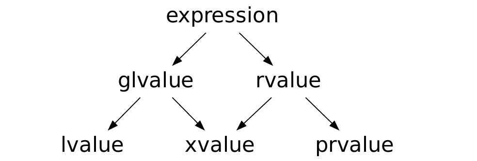

# Move-семантика, rvalue-ссылки
- [Запись лекции №1](https://www.youtube.com/watch?v=KcNJbEmbqB4)
- [Запись лекции №2](https://www.youtube.com/watch?v=p4LQfPJb9Q0)
---
## RVO, NRVO
Часто можно услышать, что передавать параметры по значению и возвращать результат из функции по значению дорого. Но это не всегда так.


Начнём с того, как передаются параметры в функцию. Например, в ABI линукса прописано, что если структура помещается в два регистра, то она передаётся через них. Если структура занимает больше, то есть два варианта:

```c++
void f(mytype x) { // как передаётся параметр?
    x.a = 42; 
}
// псевдокод:
void f(mytype const& x) {
    mytype x_copy = x;
    x_copy.a = 42;
}
// вызывающая сторона делает копию и передаёт ссылку
void f(mytype& x) {
    x.a = 42;
}
```
Можно посмотреть, во что компилируется функция `f` и увидеть, что это похоже на второй вариант. 

Этот вариант даёт возможность соптимизировать и избегать лишних копирований. Например, в таком случае:

```c++
void g() {
    f(mytype(1, 2, 3));
    f(h());
}
```

Если в функцию передаётся `rvalue`, то компилятор не будет делать лишнюю копию. Таким образом, копия делается, только если функция принимает по значению и в неё передаётся `lvalue`.

Как работает возвращение по значению:

```c++
mytype f() {
	return mytype(1, 2, 3);    
}
// компилится во что-то, похожее на:
void f(void* result) {
    mytype_ctor(result, 1, 2, 3);
}
```

Эта оптимизация называется *Return value optimization*: если из функции возвращается `rvalue`, то копия не создаётся и объект конструируется уже на месте, куда возвращается значение. Начиная с **C++17** эта оптимизация обязательна для компилятора и вошла в стандарт под названием *Copy elision*.

Помимо этого, есть оптимизация *NRVO (named RVO)*, которая позволяет избежать копирования при возврате automatic storage duration объекта. На данный момент эта оптимизация необязательная, но уже есть [proposal](http://www.open-std.org/jtc1/sc22/wg21/docs/papers/2020/p2025r0.html) на внедрение этого в стандарт

```c++
std::string f() {
    std::string tmp;
    for (;;) {
        tmp += ...;
    }
    return tmp;
}
// можно разместить tmp уже на result-е, псевдокод:
void f(void* result) {
    string_ctor(result, "abc");
    for (;;) {
        *result += ...;
    }
}
```

Применить её можно не во всех случаях. Например:

```c++
std::string g() {
    std::string a("abc");
    std::string b("def");
    if (flag) {
        return a;
    } else {
        return b;
    }
}
```

Ещё один пример, когда избегается копирование:

```c++
void g() {
    mytype a = f(); // здесь не будет вызван конструктор копирования
}
```

Так всё работало ещё в **C++03**, в **C++11** помимо оптимизаций, появилась *move-семантика*

## Move-семантика

Многие контейнеры требуют от объектов наличие конструктора копирования. Например, вектору он нужен для увеличения буфера. При этом объект нельзя скопировать побайтово через `memcpy`, потому что это изменит его адрес, что возможно не для всех объектов (например, для тех, которые передают куда-нибудь наружу указатель `this`).

Но есть такие объекты, у которых дорогое копирование, которого можно избежать (например, `std::string` с буфером), а ещё те, у которых копирование в принципе нельзя определить (как `unique_ptr`).

Эту проблему решает семантика перемещений. Она реализуется при помощи перемещающего конструктора (`move constructor`) и перемещающего оператора присваивания (`move assignment`).

Передача объекта в такой конструктор может испортить передаваемый объект, но этот объект должен остаться в таком согласованном состоянии, что у него можно вызвать деструктор. При этом это состояние в общем случае unspecified и полагаться на него не следует.

```c++
struct string {
    // ...
    string(string&& other) {
        data = other.data; // копируем указатель вместо самих данных
        other.data = nullptr;
        size = other.size;
        other.size = 0;
    }
    private:
    char* data;
}
```

Move в C++ называется "недеструктивным", так как объект остаётся валидным, просто в unspecified состоянии.

Для упрощения синтаксиса в язык были введены *rvalue-ссылки*, чтобы move оператор и конструктор срабатывал автоматически и не нужно было указывать это как-то явно.

### Ссылки

Начиная с **C++11** обычные ссылки называются lvalue-ссылками. Для rvalue-ссылок свойства ссылок сохраняются, но, они биндятся только к rvalue.

```c++
int main() {
    int a = 0;
    int& b = a;
    int& c = 42; // ошибка
    int&& d = a; // ошибка
    int&& e = 42;
}
```

Теперь можно делать перегрузки для rvalue-ссылок:

```c++
template<typename T>
struct vector {
    void push_back(T const&);
    void push_back(T&&);
}
```

В каждом месте, где делается `push_back` от rvalue, будет вызываться перегрузка именно для rvalue-ссылки.

Важный принцип: именованные переменные они всегда lvalue, независимо от того, какой у неё тип. 

```c++
struct person {
    person(std::string&& name) {
        // здесь name - lvalue
        // this.name = name; - простое копирование
        this.name = std::move(name); // вызовет move-конструктор
    }
}
```

Что такое `std::move`? Это почти что `static_cast`. Её сигнатура похожа на следующее:

```c++
template<typename T>
T&& move(T& obj) {
    return static_cast<T&&>(obj);
}
```

В стандартной библиотеке у move сигнатура немного отличается. Написанная выше функция не может принимать rvalue (например, `std::move(42)` не скомпилируется), в стандартной библиотеке move устроен таким образом, что он работает и для rvalue тоже.

Если мы хотим у конструктора, описанного выше, больше параметров, то делать перегрузки на каждую комбинацию сложно. Какое поведение конструктора мы ожидаем? Для параметров, переданных как lvalue, сделать копию, а rvalue переместить. В языке уже есть конструкция, которая делает то же самое - можно просто принять параметр по значению.

```c++
struct person {
    person(std::string name, std::string surname)
        : name(std::move(name)), 
    	  surname(std::move(surname)) {}
}
```

Так мы получим нужно поведение за исключением того, что иногда move-конструктор вызовется лишний раз (когда делаем копию и вызываем move). Обычно это оптимизируется и не влияет на производительность, но при необходимости  можно сделать разные перегрузки.

**Не стоит использовать move там, где он не нужен**:

Иногда может возникать желание написать похожую конструкцию:

```c++
std::string&& foo() {
    std::string res;
    res += "abc";
    return std::move(res); 
}
```

Из-за move такое, скорее всего, скомпилируется, но работать не будет, так как ссылка указывает на локальную переменную, которая уничтожится после выхода из функции.

Есть правило, что если даже NRVO не сработало, то при возвращении по значению вызовется move.

```c++
std::string foo() {
    std::string res;
    res += "abc";
    return res; // вызовет move при возврате, если не сработало NRVO
}
```
## Value category в C++11

В C++11 [категории значений](https://blog.panicsoftware.com/value-categories-gl-l-x-r-prvalues/) были расширены. Кроме lvalue и rvalue, появилось xvalue.



`prvalue` - то, что раньше мы называли `rvalue`

`xvalue` - то, что для перегрузок `rvalue`, а для copy elision `glvalue`


```c++
struct mytype {};
mytype lvalue;
mytype& lvalue();
mytype prvalue();
mytype&& xvalue(); // overloading: rvalue, copy elision: lvalue
void test() {
    mytype c = lvalue; // mytype(mytype)
    mytype b = prvalue(); // copy elision
    mytype a = xvalue(); // mytype(mytype&&)
}
mytype test2() {
    return xvalue(); 
}
```

С одной стороны, `xvalue` возвращает rvalue, но мы не можем применить RVO. Поэтому функция `xvalue` для перегрузок работает как rvalue, а с точки зрения copy elision как lvalue.

В C++03 время жизни объекта, который биндится к `const&`, продлевалось для rvalue. В C++11 xvalue ведут себя подобно lvalue: время жизни объекта продлить нельзя, так как мы его  никак не контролируем.

```c++
void foo() {
    mytype const& a = prvalue(); // объект живёт столько, сколько эта ссылка
    mytype&& a = prvalue(); // аналогично продлевает время жизни
    
    mytype& a = lvalue(); // не продлевает
    mytype&& a = xvalue(); // не продлевает
}
```

