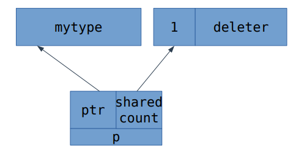
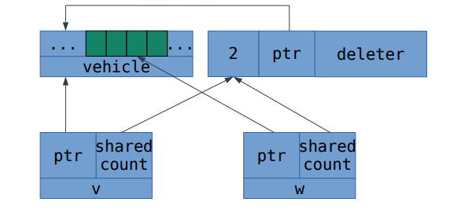

# Умные указатели
- [Слайды с лекции](slides/shared_ptr.pdf)
- [Оригинальный конспект от Вани](https://github.com/sorokin/cpp-notes/blob/master/smart-pointers.tex)
- [Запись лекции №1](https://www.youtube.com/watch?v=L9ohcGR0yFE)
- [Запись лекции №2](https://www.youtube.com/watch?v=M9h0_xBM7_8)
---
## std::unique_ptr

### Мотивирующий пример

Когда мы писали контейнеры, часто мы встречали такой код:

```c++
container* create_container() {
    container* c = new container();
    try {
        fill(*c);
    } catch (...) {
        delete c;
        throw;
    }
    return c;
}
```

Если функция `fill` бросала исключение, нам нужно было удалить память, выделенную по указателю, и пробросить исключение. Проблема такого кода, что он трудно масштабируется на несколько объектов, которые требуется удалять.

Для решения этой проблемы в C++11 появились умные указатели, которые являются RAII-обёртками над обычными указателями. Деструкторы таких указателей удаляют объект, на который они ссылаются. Например, с `std::unique_ptr` код выглядел бы так:

```c++
std::unique_ptr<container> create_container() {
    std::unique_ptr<container> c(new container());
    fill(*c);
    return c;
}
```

### Реализация

`unique_ptr` - самый простой из умных указателей. Внутри он хранит указатель `T* ptr` и вызывает `delete` от него в деструкторе.

```c++
template <typename T>
struct unique_ptr {
    unique_ptr()
        : ptr(nullptr) {}
    unique_ptr(T* ptr)
        : ptr(ptr) {}
    ~unique_ptr() {
        delete ptr;
    }
  private:
    T* ptr;
}
```

`unique_ptr` имеет операторы `*` и `->`, поэтому им можно пользоваться как обычным указателем. 

```c++
T& operator*() const {
	return *ptr;
}
T* operator->() const noexcept {
	return ptr;
}
```

Помимо этого, у него есть функция `get()`, возвращающая указатель, который лежит в нём.

```c++
T* get() const {
	return ptr;
}
```

Так же есть `release()` - зануляет `ptr`, хранящийся внутри, а старое значение возвращает наружу. `release()` обычно используется, если в некоторую функцию нужно передать указатель, который хранит `unique_ptr`, при этом известно, что функция самостоятельно удалит объект.

```c++
T* release() {
	T* tmp = ptr;
	ptr = nullptr;
    return tmp;
}
```

`reset(p)` - заменяет указатель `ptr` на `p` и делает `delete` от старого указателя.

```c++
void reset(T* p) {
	delete ptr;
	ptr = p;
}
```

В названии `unique_ptr` заключается его основное свойство - он хранит "уникальный" указатель на объект (а точнее, он единственный ответственен за его удаление). Поэтому оператор присваивания и конструктор копирования у него запрещены, но есть `move constructor` и `move assignment`:

```c++
unique_ptr(unique_ptr const& other) = delete;
unique_ptr& operator=(unique_ptr const& other) = delete;
unique_ptr& operator=(unique_ptr&& other) noexcept {
	reset(other.release());
	return *this;
}
unique_ptr(unique_ptr&& other) noexcept 
	: ptr(other.release()) {}
```

### Неявные приведения

Для `unique_ptr` реализована логика приведений аналогичная той, что есть у обычных указателей. `unique_ptr<D>` можно привести к `unique_ptr<B>` тогда и только тогда, когда разрешено приведение `D*` к `B*`.

```c++
template <typename T>
struct unique_ptr {
    template <typename U, typename = typename std::enable_if_t<is_convertible_v<U*, T*>>>
    unique_ptr(unique_ptr<U>&& other);
};
```

### Настраиваемый deleter

До этого мы говорили, что деструктор у `unique_ptr` вызывает `delete` от указателя. В общем случае это не всегда верно. Например, память под объект могла быть выделена кастомным аллокатором или `malloc`, `new[]`. Для такого использования `std::unique_ptr` поддерживает пользовательский `deleter`. По умолчанию в качестве `deleter` используется класс `std::default_delete`, который вызывает `delete` на указателе. 

Реализация `unique_ptr` с `deleter` могла бы выглядеть так:

```c++
template<typename T, typename D = default_delete<T>>
struct unique_ptr {
    using pointer = typename D::pointer;
    unique_ptr(pointer);
    unique_ptr(pointer, D);
    ~unique_ptr() {
        deleter(ptr);
    }
  private:
    pointer ptr;
    D deleter;
}
```

К сожалению, в реальности реализация сложнее из-за следующих причин:

- Шаблонный параметр `D` может быть не только самим `deleter`, но и ссылкой на него, поэтому ссылку с `D` нужно снимать.
- `Deleter` не обязан содержать `typedef pointer`. Если он отсутствует, `unique_ptr` должен использовать `T*` вместо него. Это можно сделать SFINAE-проверкой.
- Часто `deleter` это пустой объект, поэтому, чтобы не увеличивать размер `unique_ptr`, пользуются empty-base оптимизацией.

При перемещении `unique_ptr`, перемещается и его `deleter`. Отдельный случай - это неявные приведения, так как `unique_ptr` от разных типов могут иметь разные `deleter`. При использовании кастомных `deleter`, `unique_ptr<T1, D1>` приводится к `unique_ptr<T2, D2>`, если выполнено одно из двух условий:

- `D2` - ссылка, `D1` совпадает с `D2`
- `D2` - не ссылка, `D1` приводится к `D2`

#### unique_ptr для массивов

Для массивов у `unique_ptr` есть отдельная специализация:

```c++
template <typename T, typename D = default_delete<T>>
struct unique_ptr;

template <typename E, typename D>
struct unique_ptr<E[], D> {
    E& operator[](size_t index) const;
};
```

Отличается она следующим:

- Наличием `operator[]`

- Хранит внутри `E*`, а не `T*`

- Использует более сильные правила для неявных преобразований, так как приведение указателей на массивы зависит не только от типов, но и от размеров массивов.

`default_delete` можно использовать и для массивов, так как у него тоже есть специализация, которая делает `delete[]` вместо `delete`.

## std::shared_ptr

### Термин "владение"

Владением называют ответственность за удаление объекта. Например, `unique_ptr` ответственен за удаление объекта, на который он ссылается, соответственно говорят, что `unique_ptr` владеет объектом, на который он ссылается. Функция `reset(p)` передаёт владение объектом, а функция `release()` наоборот, забирает владение объектом.

В некоторых случаях у объекта может быть несколько владельцев. Это называется разделяемым владением и работает следующим образом: за удаление объекта ответственен последний владелец. Для умных указателей существует два способа реализации такого владения: подсчёт ссылок и провязка всех владельцев в двусвязный список. `std::shared_ptr` использует подсчёт ссылок. Указатель, использующий провязку владельцев в двусвязный список, в стандартной библиотеке отсутствует, но часто его называют `linked_ptr`.

### Пример применения

`shared_ptr` очень похож на логику, которая нужна для реализации оптимизации Copy-on-Write.

`shared_ptr<data const>`можно использовать, если не нужно модифицировать значение.

### Реализация

```c++
template<typename T>
struct shared_ptr {
    shared_ptr();
    explicit shared_ptr(T* ptr);
    shared_ptr(shared_ptr const& other);
    shared_ptr& operator=(shared_ptr const& other);
};
```

Как и `unique_ptr`, `shared_ptr` поддерживает операции `operator*`, `operator->`, `reset`, `get`. Операции `release` у `shared_ptr` нет, потому что могут быть другие `shared_ptr`, ссылающиеся на этот объект.

`shared_ptr` внутри себя хранит указатель на ссылаемый объект и указатель на счётчик ссылок. Поскольку счётчик ссылок у всех `shared_ptr`, ссылающихся на один и тот же объект, общий, то память под него аллоцируется динамически.

```c++
template<typename T>
struct shared_ptr {
    shared_ptr()
      : ptr(nullptr),
    	ref_counter(nullptr) {}
    shared_ptr(T* ptr)
	  : ptr(ptr) {
    	if (ptr == nullptr) {
			return;
		}
		try {
			ref_counter = new size_t(1);
		} catch (...) {
			delete ptr;
			throw;
		}
     }
    shared_ptr(shared_ptr const& other)
      : ptr(other.ptr),
    	ref_counter(other.ref_counter) {
		if (ptr == nullptr) {
			return;
		}
		++ref_counter;
	}
    ~shared_ptr() {
        if (ptr == nullptr) {
            return;
        }
        if (--*ref_counter == 0) {
            delete ref_counter;
            delete ptr;
        }
    }
  private:
    T* ptr;
    size_t* ref_counter;
}
```

Если `shared_ptr` не ссылается ни на один объект, то `ptr == nullptr`, `ref_counter == nullptr`.

Если `shared_ptr` ссылается на некоторый объект, то `ptr != nullptr`, `ref_counter != nullptr`, `*ref_counter` равен числу `shared_ptr`, ссылающихся на объект `*ptr`.

### Проблема разделения счётчика ссылок

Посмотрим на следующий код:

```c++
T* p = new T();
std::shared_ptr<T> p1(p);
std::shared_ptr<T> p2(p);
```

Такой код некорректен, так как у `p1` и `p2` разные счётчики ссылок, поэтому объект `*p` удалится дважды. Такая ситуация называется разделением (*split*) счётчика ссылок. Разделение счётчика ссылок - ошибка, поэтому в корректных программах оно возникать не должно.

Чтобы не происходило разделение счётчика ссылок, не нужно оборачивать один сырой указатель в `shared_ptr` дважды. Использование `std::make_shared` или использование `std::enable_shared_from_this` также позволяет избежать разделения счётчика ссылок.

### Настраиваемый deleter

Если в `shared_ptr`, например, похранить массив (или любой объект, созданный не с помощью `new`), то, по аналогии с `unique_ptr`, нам нужен `deleter`. Он может храниться, например, в памяти рядом с счётчиком ссылок.



### Aliasing constructor

Иногда возникает желание ссылаться с помощью `shared_ptr` на объект и его мемберов.

Наивное решение такого:

```c++
struct wheel {};
struct vehicle {
    std::array<std::shared_ptr<wheel>, 4> wheels;
};
```

Проблема такого подхода в том, что при удалении `vehicle`, `wheel` остаются живы, пока на них кто-то ссылается.

Можем захотеть такое поведение: пока кто-то ссылается на составную часть объекта, основной объект жив. Для этого можно хранить для них общий счётчик ссылок.

```c++
struct vehicle {
    std::array<wheel, 4> wheels;
}
std::shared_ptr<vehicle> v(new vehicle);
std::shared_ptr<wheel> w(v, &v->wheels[2]);
```

В таком случае оба указателя отвечают за удаление объекта `vehicle` (в зависимости от того, какой из указатель раньше будет разрушен), поэтому `deleter` у них общий, кроме того в управляющем блоке хранится `ptr` на исходный объект, чтобы передать его в `deleter`.




Одно из применений такого конструктора - указатели в дереве. Пока будет существовать хотя бы один указатель на элемент дерева, всё дерево будет продолжать существовать.

### std::make_shared

Рассмотрим следующий пример кода:

```c++
shared_ptr<mytype> sp(new mytype(1, 2, 3));
```

Такой код аллоцирует два объекта в куче - один при создании `new mytype`, другой - счётчик ссылок внутри `shared_ptr`. Таким образом, такое использование удваивает количество аллокаций, что не очень хорошо.

Для решения этой проблемы существует специальная функция `make_shared`:

```c++
template<typename T, typename... Args>
shared_ptr<T> make_shared(Args&&... args);
```

`make_shared` создаёт объект типа `T` и возвращает `shared_ptr` на него. При этом `make_shared` делает одну аллокацию памяти, то есть и объект, и счётчик ссылок выделяются в одном блоке.


Кроме экономии аллокаций, `make_shared` избавляет нас от необходимости следить за исключениями в `new`. Пример кода:

```c++
bar(std::shared_ptr<mytype>(new mytype(1, 2, 3)),
   std::shared_ptr<mytype>(new mytype(4, 5, 6)));
```

Так как порядок выполнения не задан, сначала может вызваться первый `new`, затем второй, а потом только конструкторы `shared_ptr`. В таком случае, если второй `new` кинет исключение, то первый объект не удалится. `make_shared` позволяет такое избежать.

## std::weak_ptr

`weak_ptr` - парный указатель к `shared_ptr`.  Он нужен, чтобы ссылаться на объект, но не мешать ему удаляться. Один из способов его реализации - хранить отдельно счётчики сильных и слабых ссылок. Для удобства в проверках счётчик слабых ссылок не нулевой, если есть хотя бы одна сильная ссылка (например, можно для каждой сильной ссылки увеличивать счётчик слабых).

Пример применения `weak_ptr` - кэши.

```c++
shared_ptr<widget> get_widget(int id) {
    static map<int, weak_ptr<widget>> cache;
    auto sp = cache[id].lock();
    if (!sp) {
        cache[id] = sp = load_widget(id);
    }
    return sp;
}
```

В этом примере `weak_ptr` не мешают удаляться виджетам. Метод`lock` у `weak_ptr` создаёт новый `shared_ptr` на объект, если объект ещё не удалён, иначе возвращает пустой `shared_ptr`.

Проблема примера выше в том, что из `cache` никогда не удаляются вхождения, даже если объекты удалены. При этом, так как у нас будут висеть `weak_ptr`, не будут удаляться `control_block`'и (счётчики ссылок в памяти). 

Это можно решить, например, [кастомным делитером](https://gist.github.com/sorokin/7f23a639b3a8733f10ab77b06da28e44), который будет удалять из мапы. Проблема реализации, приведённой по ссылке, в том, что там не применяется `make_shared`, так как у объекта кастомный `deleter`. Это можно решить с помощью [обёртки над объектом](https://gist.github.com/sorokin/811648e5e305ab1d62e7a750e2b53d27), деструктор которой будет удалять объект из мапы. Тогда можно применить *aliasing constructor*, чтобы получать указатели не на обёртку, а на сам объект - member обёртки.

Так же стоит упомянуть, что использование `make_shared` с `weak_ptr` может быть неэффективным. Так как `make_shared` создаёт объект и счётчик ссылок одним блоком памяти, то даже когда счётчик сильных ссылок обнулится, `control_block` продолжит существовать, пока жив хотя бы один `weak_ptr`. Таким образом память, выделенная под объект, не будет освобождена до удаления `control block` (хотя деструктор объекта вызовется).

### std::enable_shared_from_this

Если хотим вернуть `shared_ptr` от `this`, то нельзя сделать это просто как `std::shared_ptr(this)`, так как на каждый `shared_ptr` будут разные `control_block`'и. В стандартной библиотеке для этого есть класс `std::enable_shared_from_this`:

```c++
struct mytype : std::enable_shared_from_this<mytype> {
    std::shared_ptr<mytype> bar() {
        return shared_from_this();
    }
}
```

Реализация `enable_shared_from_this` хранит внутри `weak_ptr`, от которого создаётся `shared_ptr` при вызове `shared_from_this()`.

Конструктор `shared_ptr(T*)` использует SFINAE-проверки для определения наследования от `enable_shared_from_this`, поэтому наследоваться нужно публично.

`shared_from_this()` можно вызывать только от previously shared объектов, поэтому нельзя вызывать её внутри конструктора и деструктора. Конструктор обычного `shared_ptr` для объектов, которые наследуются от `enable_shared_from_this`, "включает" возможность создавать shared_from_this. При вызове `std::shared_ptr(U*)` для указателя на тип U, у которого есть unambiguos and accessible базовый класс, который является специализацией `std::enable_shared_from_this`, выполняется следующее:

```c++
if (ptr != nullptr && ptr->weak_this.expired())
  ptr->weak_this = std::shared_ptr<std::remove_cv_t<U>>(*this,
                                  const_cast<std::remove_cv_t<U>*>(ptr));
```

Поэтому, если от объекта не создавался `shared_ptr`, вызов функции `shared_from_this()`  начиная с C++17 бросит исключение `std::bad_weak_ptr`, а до C++17 ведёт к UB.

При этом, даже если объект наследуется от `enable_shared_from_this`, создание нескольких `shared_ptr` от указателя на один объект не гарантирует, что это будет эквивалентно вызовам `shared_from_this()` и является UB.

### Приведения shared_ptr к указателям

В стандартной библиотеке [реализованы](https://en.cppreference.com/w/cpp/memory/shared_ptr/pointer_cast) все 4 вида кастов (`static`, `dynamic`, `const`, `reinterpret`) для `shared_ptr` - они создают новый инстант `shared_ptr`, который хранит указатель приведённый соответствующим кастом и разделяет владение (счётчик ссылок) с исходным `shared_ptr`.

Внутри это выглядит так (на примере `static_cast`):

```c++
template <class T, class U> 
std::shared_ptr<T> static_pointer_cast( const std::shared_ptr<U>& r ) noexcept {
    auto p = static_cast<typename std::shared_ptr<T>::element_type*>(r.get());
    return std::shared_ptr<T>(r, p);
}
```

`dynamic_cast` выглядит немного иначе - в случае "неудачного каста" (который возвращает `nullptr`) создаётся пустой `shared_ptr`.

