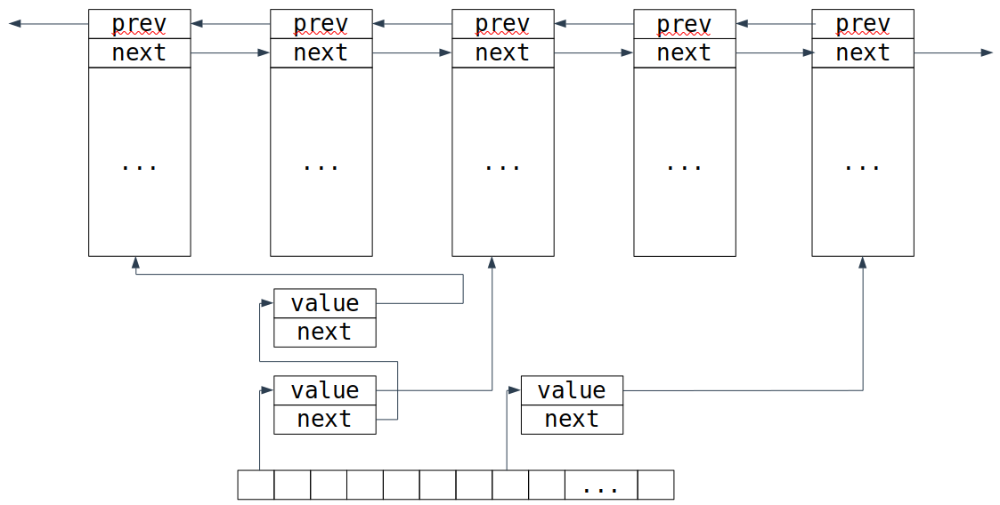
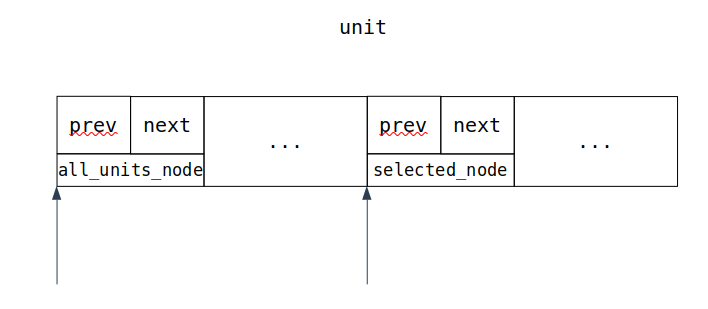

# Интрузивные контейнеры 

В лекции часто упоминается статья ["Avoiding game crashes related to linked lists"](https://www.codeofhonor.com/blog/avoiding-game-crashes-related-to-linked-lists) про то, как в Starcarft применяли интрузивные списки, и статья [Intrusive linked lists in practice](https://www.data-structures-in-practice.com/intrusive-linked-lists/)
- [Слайды с лекции](slides/intrusive.pdf)
- [Запись лекции №1](https://www.youtube.com/watch?v=Kf7qkcaWetc)
- [Разбор практики по intrusive_list](https://www.youtube.com/watch?v=fwPUzKDsQTA)
- [Код intrusive_list](https://github.com/sorokin/intrusive_list)
---

## Уважаемые знатоки, внимание, вопрос...
Вот рассказывают нам на алгоритмах чудесную структуру данных: связный список. И всегда оговаривают, что в жизни он используется в очень редких случаях (вон в Java `LinkedList` вообще бесполезен). Но есть же какая-то цель у всего этого, правда? Зачем-то же нужен связный список?

## Мотивирующий пример

**Задача:** есть набор юнитов, которые уже хранятся в двусвязном списке (мы хотим быстро удалять из середины). И нужно хранить подмножество каких-то выделенных. Наивное решение такое:

```c++
struct unit {
    unit* prev;
    unit* next;
}
std:unordered_set<unit*> selected;
```

Как тогда это выглядит в памяти? Ну, у нас есть связный список, а ещё есть таблица, в которой тоже связные списки:



Кажется, что список внутри таблицы избыточен. Можно сделать таблицу с открытой адресацией, но давайте рассмотрим другое решение: прошить наши юниты другим списком (для каждого юнита хранить `selected_next` и `selected_prev`):

```c++
struct unit {
    // Данные

    // Глобальный список всех юнитов.
    unit* prev; 
    unit* next;

    // Список выбранных юнитов.
    unit* selected_prev;
    unit* selected_next;
}
```


Преимущества такой реализации:

- Удаление элементов из списка выбранных работает за честную константу (без поиска).
- Нет аллокаций при вставке/удалении.
- Использование двусвязного списка содержит на константу меньше операций, чем хеш-таблицы.
- Локальность ссылок при итерации по элементам.

Но тратим больше памяти - храним по два указателя на каждый юнит, а не только выбранный. Впрочем, если выбранных юнитов у нас много, то такая реализация выгоднее окажется, потому что в случае с хэш-таблицей мы храним дополнительный указатель.

## Ещё более мотивирующий пример.

А теперь давайте заметим, что нам никто не мешает сделать то же самое не со списками, а с любыми структурами данных, основанными на указателях. Например, мы можем любую структуру данных прошить деревом поиска, чтобы что-то там поискать. Например, так можно реализовать LRU-кэш (least recently used).

Идея вот какая. Есть функция, которая очень долго считается. И мы хотим кэшировать её результаты. Но чтобы у нас не росла память бесконечно долго, мы хотим удалять элементы, которые долго не использовались. Давайте для этого возьмём `std::map` (в котором у нас результаты вычислений) и прошьём его двусвязными списком:

```c++
struct node {
    Key key;
    Value value;

    // ordered by key
    node* left;
    node* right;
    node* parent;

    // ordered by access time
    node* next;
    node* prev;
}
```

И при обращении к элементу из кэша, он будет перекидываться в хвост списка (а в дереве оставаться на месте), а при нехватке места, будем удалять элемент из головы списка.

## Обобщение до контейнера

Кажется, мы можем встраивать любую структуру в любую другую. Хочется как-то промышленно это делать, а не руками вписывать поля одной структуры в другую.

### C-style подход

```c
struct list_element {
    list_element* prev;
    list_element* next;
};
struct unit {
    list_element all_units_node;
    // ...
    list_element selected_node;
    // ...
};
```



У такого подхода есть недостаток - перебор по контейнеру идёт по `list_element` и получить сам `unit` не так тривиально:

```c++
#define container_of(ptr, type, member) \
	((type*)((char*)(ptr) - offsetof(type, member)))
```

Причём то, что тут написано — минималистичный вариант, обычно в таком макросе ещё заводится переменная.

Такого сорта штуки встречаются по всему ядру Linux в языке C, но в C++ с ней есть проблема: по стандарту такое корректно только для C-style структур (например, без виртуальных функций). Иначе это большое UB, и будет предупреждение, что это нарушает стандарт.

### C++ подход

А давайте сейчас подумаем, что концептуально происходит в примере выше? Мы берём поле структуры с смещаемся назад по памяти на фиксированное расстояние. Есть ли у нас в C++ что-т похожее и из коробки?

Ну, конечно, есть, это же множественное наследование (а точнее приведение базового класса к наследуемому):

```c++
struct list_element {
    list_element* prev;
    list_element* next;
};
struct unit : list_element {
    // Some data...
};
```

Проблема возникает в том случае, если мы хотим вставить `unit` в несколько списков (нельзя наследоваться от одного класса дважды). На помощь приходят шаблоны: давайте нашему базовому классу дадим неиспользуемый шаблонный параметр:

```c++
template <typename Tag>
struct list_element {
    list_element* prev;
    list_element* next;
};
struct all_units_tag {};
struct selected_units_tag {};

struct unit : list_element<all_units_tag>,
              list_element<selected_units_tag> {
    // Some data.
};
```

Или даже чуть проще можно:

```c++
template <typename Tag>
struct list_element {
    list_element* prev;
    list_element* next;
};
struct unit : list_element<struct all_units_tag>,
              list_element<struct selected_units_tag> {
    // Some data.
};
```

## Реализация.

Всего этого вы не найдёте в стандартной библиотеке. Был [proposal](http://www.open-std.org/jtc1/sc22/wg21/docs/papers/2016/p0406r1.html) в стандарт, чтобы туда добавили интрузивные контейнеры, но его почему-то забросили. Зато это чудо есть в [библиотеке Boost](https://www.boost.org/doc/libs/1_71_0/doc/html/intrusive.html). Более того, там им можно разное поведение задавать. В boost'е контейнеры умеют работать и через наследование, и через `offsetof`, а ещё есть три способа взаимодействия списков с элементом:

- Ничего не делать (пользователь обязан удалить элемент сам из списков перед тем, как удалять его).
- Safe hook — проверяет, что элемент удалился из всех списков.
- Unlink hook — отвязывает элемент от всех списков, в которых он находится.

## Сравнение с обычными контейнерами.
||Intrusive|Обычные|
|-|:-:|:-:|
|Менеджмент памяти|Внешнее|Внутреннее
|Время на вставку/удаление|Быстрее|Медленнее
|Локальность памяти|Лучше|Хуже
|Можно вставить один объект в два контейнера|Нет|Да
|Гарантия исключений|Nothrow|Как попало
|Получить итератор из значения|Тривиально|Очень сложно
|Использование памяти|Минимально|Не настолько минимально
|Вставить объект, сохраняя полиморфизм|Можно|Нельзя из-за slicing’а
|Пользователь должен изменить определение объекта|Да|Нет
|Возможность копировать контейнер|Нельзя|Можно
|Время жизни определяется...|Пользователем|Контейнером
|Возможность сломать инварианты контейнера|На изи вообще|Очень сложно
|Аналитика потокобезопасности|Сложная|Простая


## Multi_index.

Есть такая весёлая штука, называется [`multi_index`](https://www.boost.org/doc/libs/1_62_0/libs/multi_index/doc/index.html). Это штука, которой можно сказать, что вы хотите иметь внутри заданные intrusive-контейнеры, но чтобы они владели. Например, написав вот такую штуку, мы получим LRU-кэш (нормальный, владеющий своими элементами):

```c++
boost::multi_index::indexed_by<
    boost::multi_index::sequenced<>,
    boost::multi_index::ordered_unique<
        boost::multi_index::member<value_type, const key_type, &value_type::first>>>
```


