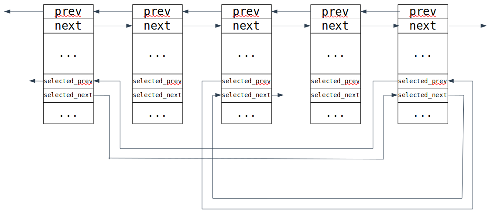

# Интрузивные контейнеры 

В лекции часто упоминается статья ["Avoiding game crashes related to linked lists"](https://www.codeofhonor.com/blog/avoiding-game-crashes-related-to-linked-lists) про то, как в Starcarft применяли интрузивные списки, и статья [Intrusive linked lists in practice](https://www.data-structures-in-practice.com/intrusive-linked-lists/)
- [Слайды с лекции](slides/intrusive.pdf)
- [Запись лекции №1](https://www.youtube.com/watch?v=Kf7qkcaWetc)
- [Разбор практики по intrusive_list](https://www.youtube.com/watch?v=fwPUzKDsQTA)
- [Код intrusive_list](https://github.com/sorokin/intrusive_list)
---

## Мотивирующий пример

**Задача:** есть набор юнитов, нужно хранить подмножество каких-то выделенных. Наивное решение такое:

```c++
struct unit {
    unit* prev;
    unit* next;
}
std:unordered_set<unit*> selected;
```


Как оптимально хранить это? Одно из решений - для каждого юнита хранить `selected_next` и `selected_prev`.

```c++
struct unit {
    unit* prev;
    unit* next;
    unit* selected_prev;
    unit* selected_next;
}
```



Зачем это нужно? Удаление таких элементов из списка будет работать за константу без поиска, так как сам `unit` является узлом списка.

Преимущества такой реализации:

- Нет аллокаций при вставке/удалении
- Двусвязный список использовать "дешевле", чем хеш-таблицу
- Локальность ссылок при итерации по элементам

Но тратим больше памяти - храним по два указателя на каждый юнит, а не только выбранный.

Всё это обобщается на другие структуры данных: двусвязные списки, деревья, хеш-таблицы со списками. 

Например, так можно реализовать LRU-кэш:

```c++
Value f(Key key);

std::unordered_map<Key, Value> cache;
```

Хотим ограничить размер кэша. Для этого элементы провяжем двусвязным списком и будем удалять самый давний по использованию.

```c++
struct node {
    Key key;
    Value value;
    // ordered by key
    node* left;
    node* right;
    node* parent;
    // ordered by value
    node* next;
    node* prev;
}
```

Тогда при обращении к элементу из кэша, он будет перекидываться в хвост, а при нехватке места, будет удалять элемент из головы списка.

## Обобщение до контейнера

### C-style подход

```c
struct list_element {
    list_element* prev;
    list_element* next;
};
struct unit {
    list_element all_units_node;
    // ...
    list_element selected_node;
    // ...
};
```


У такого подхода есть недостаток - перебор по контейнеру идёт по `list_element` и получить сам `unit` не так тривиально:

```c++
#define container_of(ptr, type, member) \
	((type*)((char*)(ptr) - offsetof(type, member)))
```

По стандарту такое корректно только для C-style структур (например, без виртуальных функций). Иначе это работает, но будет ворнинг, что это нарушает стандарт.

### C++ подход

Как сделать такое корректно средствами C++? Использовать базовых классы, так как каст к ним работает аналогично.

```c++
struct list_element {
    list_element* prev;
    list_element* next;
};
struct unit : list_element {};
```

Проблема возникает в том случае, если мы хотим вставить `unit` в несколько списков, то есть сделать ему несколько базовых классов `list_element`. На помощь приходят шаблоны:

```c++
template <typename Tag>
struct list_element {
    list_element* prev;
    list_element* next;
};
struct all_units_tag {};
struct selected_units_tag {};
struct unit : list_element<all_units_tag>, list_element<selected_units_tag> {};
```

В [proposal](http://www.open-std.org/jtc1/sc22/wg21/docs/papers/2016/p0406r1.html) в стандартную библиотеку использовался именно такой приём.

Замечание: не обязательно типы тегов должны быть полными. Кроме того, их можно объявить прямо в объявлении `unit`.

```c++
struct unit : list_element<struct all_units_tag>, list_element<struct selected_units_tag> {};
```

Реализация intrusive контейнеров есть в [библиотеке Boost](https://www.boost.org/doc/libs/1_71_0/doc/html/intrusive.html). Для контейнеров из буста можно задать разное поведение `list_element` при разрушении `unit`:

- Ничего не делать (пользователь обязан удалить юнит из списков перед тем, как удалять его)
- Safe hook - проверяет, что элемент удалился из всех списков
- Unlink hook - отвязывает элемент от всех списков, в которых он находится

## Полезное применение:

```c++
struct person {
    std::string name;
    std::string id;
    std::string company_name;
    int min;
}
```

Можно хранить объекты и искать, например, по имени и по id, при помощи [boost.multi_index](https://www.boost.org/doc/libs/1_62_0/libs/multi_index/doc/index.html).


## intrusive_ptr

Похож на `shared_ptr`, но счётчик ссылок хранится в самом объекте (похоже на `make_shared`, при использовании которого счётчик ссылок и объект создавались рядом в памяти). В отличие от `shared_ptr`, позволяет без динамических аллокаций реализовать разделённое владение объектом. 

Каждый новый инстанс `intrusive_ptr` увеличивает счетчик ссылок вызовом функции `intrusive_ptr_add_ref`, которая должна быть определена у объекта, при удалении вызывает у объекта функцию `intrusive_ptr_release`, которая отвечает за разрушение объекта, если счетчик ссылок стал равен нулю.

В библиотеке есть вспомогательный базовый класс `intrusive_ref_counter`, от которого можно наследовать пользовательские типы, чтобы реализовать поддержку `intrusive_ptr`.

Подробнее можно почитать в [документации Boost](https://www.boost.org/doc/libs/1_60_0/libs/smart_ptr/intrusive_ptr.html)