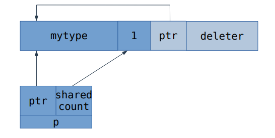

# Умные указатели
- [Слайды с лекции](slides/shared_ptr.pdf)
- [Оригинальный конспект от Вани](https://github.com/sorokin/cpp-notes/blob/master/smart-pointers.tex)
- [Запись лекции №1](https://www.youtube.com/watch?v=L9ohcGR0yFE)
- [Запись лекции №2](https://www.youtube.com/watch?v=M9h0_xBM7_8)
---

Как мы знаем, умный указатель — это то, что позволяет ссылаться на объект, и в деструкторе удаляет его. С одним из умных указателей мы [уже успели бегло познакомиться ранее](./08_exceptions.md#stdunique_ptr).

## `std::unique_ptr`.
Как мы обсуждали, `std::unique_ptr` — это просто RAII'шная обёртка над указателем. Всю мотивацию и примерную реализацию можно найти [раньше](./08_exceptions.md#stdunique_ptr). А сейчас давайте обсудим `std::unique_ptr` детальнее.

### Повторение уже изученного.

Внутри себя `std::unique_ptr` хранит указатель `T* ptr` и вызывает `delete` от него в деструкторе.

```c++
template <class T>
class unique_ptr {
private:
	T* ptr;

public:
	unique_ptr() : ptr(nullptr) {}
	unique_ptr(T* ptr) : ptr(ptr) {}
	unique_ptr(const unique_ptr&) = delete;
	unique_ptr& operator=(const unique_ptr&) = delete;

	~unique_ptr() {
		delete ptr;
	}
}
```

Также `unique_ptr` имеет операторы `*` и `->`, поэтому им можно пользоваться как обычным указателем. 

```c++
	T& operator*() {
		return *ptr;
	}
	T* operator->() {
		return ptr;
	}
```

Помимо этого, у него есть функция `get()`, делающая то же самое, что `operator->`.

```c++
	T* get() const {
		return ptr;
	}
```

Так же есть `release()` — зануляет `ptr`, а старое значение возвращает наружу. `release()` обычно используется, если в некоторую функцию нужно передать указатель, который хранит `unique_ptr`, при этом известно, что функция самостоятельно удалит объект.

```c++
	T* release() {
		T* tmp = ptr;
		ptr = nullptr;
	    return tmp;
	}
```

А ещё есть `reset(T* new_ptr)` - заменяет указатель `ptr` на `new_ptr` и делает `delete` от старого указателя.

```c++
	void reset(T* new_ptr = nullptr) {
		delete ptr;
		ptr = new_ptr;
	}
```

В названии `unique_ptr` заключается его основное свойство - он хранит "**уникальный**" указатель на объект. Поэтому оператор присваивания и конструктор копирования у него запрещены:

```c++
	unique_ptr(unique_ptr const& other) = delete;
	unique_ptr& operator=(unique_ptr const& other) = delete;
```

### Наконец-то что-то новое.

#### Перемещение.

...зато у `std::unique_ptr` есть перемещение:
```c++
	unique_ptr& operator=(unique_ptr&& other) noexcept {
		reset(other.release());
		return *this;
	}
	unique_ptr(unique_ptr&& other) noexcept 
		: ptr(other.release()) {}
```

#### Неявные приведения.

А ещё для `unique_ptr` реализована логика приведений (аналогичная той, что есть у обычных указателей). `unique_ptr<D>` можно привести к `unique_ptr<B>` тогда и только тогда, когда разрешено приведение `D*` к `B*`.

```c++
template <typename T>
struct unique_ptr {
	template <typename U,
              typename = std::enable_if_t<is_convertible_v<U*, T*>>>
	unique_ptr(unique_ptr<U>&& other);
};
```

#### Настраиваемый deleter.

До этого мы говорили, что деструктор у `unique_ptr` вызывает `delete` от указателя. В общем случае это не всегда верно. Например, память под объект могла быть выделена кастомным аллокатором или `malloc` или `new[]`. Для такого использования `std::unique_ptr` поддерживает пользовательский способ удалять указатель (называется `deleter`). По умолчанию в качестве `deleter` используется класс `std::default_delete`, который вызывает `delete` на указателе. 

Реализация `unique_ptr` с `deleter` могла бы выглядеть так:

```c++
template<typename T, typename D = default_delete<T>>
struct unique_ptr {
	using pointer = typename D::pointer;
	unique_ptr(pointer);
	unique_ptr(pointer, D);
	~unique_ptr() {
		deleter(ptr);
	}
  private:
	pointer ptr;
	D deleter;
}
```

К сожалению, в реальности реализация сложнее из-за следующих причин:

- Шаблонный параметр `D` может быть не только самим `deleter`, но и ссылкой на него, поэтому ссылку с `D` нужно снимать.
- `Deleter` не обязан содержать `typedef pointer`. Если он отсутствует, `unique_ptr` должен использовать `T*` вместо него. Это можно сделать SFINAE-проверкой.
- Часто `deleter` это пустой объект, поэтому, чтобы не увеличивать размер `unique_ptr`, пользуются empty-base оптимизацией.

При перемещении `unique_ptr`, перемещается и его `deleter`. Отдельный случай - это неявные приведения, так как `unique_ptr` от разных типов могут иметь разные `deleter`. При использовании кастомных `deleter`, `unique_ptr<T1, D1>` приводится к `unique_ptr<T2, D2>`, если выполнено одно из двух условий:

- `D2` - ссылка, `D1` совпадает с `D2`
- `D2` - не ссылка, `D1` приводится к `D2`

#### `unique_ptr<T[]>`.

Для массивов у `unique_ptr` есть отдельная специализация:

```c++
template <typename T, typename D = default_delete<T>>
struct unique_ptr { /* Всё, что мы знаем */ }

template <typename E, typename D>
struct unique_ptr<E[], D> {
    E& operator[](size_t index) const;
};
```

Отличается она следующим:

- Наличием `operator[]`
- Хранит внутри `E*`, а не `T*`.
- Использует более сильные правила для неявных преобразований, так как приведение указателей на массивы зависит не только от типов, но и от размеров массивов.

`default_delete` можно использовать и для массивов, так как у него тоже есть специализация, которая делает `delete[]` вместо `delete`.

## `std::shared_ptr`.

### Термин "владение".

Владением называют ответственность за удаление объекта. Например, `unique_ptr` ответственен за удаление объекта, на который он ссылается, соответственно говорят, что `unique_ptr` владеет объектом, на который он ссылается. Функция `reset(new_ptr)` передаёт владение объектом, а функция `release()` наоборот, забирает владение объектом.

В некоторых случаях у объекта может быть несколько владельцев. Это называется разделяемым владением и работает следующим образом: за удаление объекта ответственен последний владелец. Для умных указателей существует два способа реализации такого владения: подсчёт ссылок и провязка всех владельцев в двусвязный список. `std::shared_ptr` использует подсчёт ссылок. Указатель, использующий провязку владельцев в двусвязный список, в стандартной библиотеке отсутствует, но часто его называют `linked_ptr`.

Для тех, кто не понял предыдущий параграф: в `std::shared_ptr` есть счётчик ссылок, и когда они заканчиваются, объект удаляется.

### Bad practices.

Не надо абьюзить `shared_ptr`. Мы уже обсуждали один из способов его абьюзить в главе про [move-семантику](./17_move_rvalue.md#мотивация). Не надо так. Используйте `shared_ptr` тогда, что именно как указатель вы хотите его использовать.

### Несколько фичей `std::shared_ptr`.

Как и `unique_ptr`, `shared_ptr` поддерживает операции `operator*`, `operator->`, `reset`, `get`. Операции `release` у `shared_ptr` нет, потому что могут быть другие `shared_ptr`, ссылающиеся на этот объект. И ещё у `shared_ptr` тоже есть [`deleter`](#настраиваемый-deleter).

Но давайте ещё вот на что посмотрим. У нас есть машина. И у неё есть 4 колеса. И нам хочется, чтобы кто-то мог отдельно ссылаться на колёса, а не на саму машину. Более того, вам может захотеться, чтобы если кто-то ссылался на колёса, то сама машина не удалялась. Это делается так:
```c++
std::shared_ptr<vehicle> v(new vehicle());
std::shared_ptr<wheel> v(v, &v->wheel[2]);
```
Это называется [*aliasing constructor*](https://en.cppreference.com/w/cpp/memory/shared_ptr/shared_ptr), и он делится владением с оригинальным конструктором, но содержит внутри себя другой указатель. И тут уже ваша ответственность следит за тем, что колесо не умрёт раньше автомобиля. В данном случае (когда мы ссылаемся на поле или базовый класс) это так, но в более сложном случае это может быть не правда. Через это чудо работают [`pointer cast`'ы](#приведения-shared_ptr).

### Реализация

`shared_ptr` внутри себя хранит указатель на ссылаемый объект и указатель на счётчик ссылок. Поскольку счётчик ссылок у всех `shared_ptr`, ссылающихся на один и тот же объект, общий, то память под него аллоцируется динамически.

```c++
template<typename T>
struct shared_ptr {
    shared_ptr()
      : ptr(nullptr),
    	ref_counter(nullptr) {}
    shared_ptr(T* ptr)
	  : ptr(ptr) {
    	if (ptr == nullptr) {
			return;
		}
		try {
			ref_counter = new size_t(1);
		} catch (...) {
			delete ptr;
			throw;
		}
     }
    shared_ptr(shared_ptr const& other)
      : ptr(other.ptr),
    	ref_counter(other.ref_counter) {
		if (ptr == nullptr) {
			return;
		}
		++ref_counter;
	}
    ~shared_ptr() {
        if (ptr == nullptr) {
            return;
        }
        if (--*ref_counter == 0) {
            delete ref_counter;
            delete ptr;
        }
    }
  private:
    T* ptr;
    size_t* ref_counter;
}
```

На самом деле хранится не `ref_counter`, а структурка из `size_t`, `T*` и `deleter`'а. В MSVC она называется *control block*.


Зачем там указатель? Чтобы [aliasing constructor](#несколько-фичей-stdshared_ptr). В таком случае картинка будет выглядеть так:


Если `shared_ptr` не ссылается ни на один объект, то `ptr == nullptr`, `ref_counter == nullptr`.

Если `shared_ptr` ссылается на некоторый объект, то `ptr != nullptr`, `ref_counter != nullptr`, `*ref_counter` равен числу `shared_ptr`, ссылающихся на объект `*ptr`.

### Проблема разделения счётчика ссылок.

Посмотрим на следующий код:

```c++
T* p = new T();
std::shared_ptr<T> p1(p);
std::shared_ptr<T> p2(p);
```

Такой код некорректен, так как у `p1` и `p2` разные счётчики ссылок, поэтому объект `*p` удалится дважды. Такая ситуация называется разделением (*split*) счётчика ссылок. Разделение счётчика ссылок - ошибка, поэтому в корректных программах оно возникать не должно.

Чтобы не происходило разделение счётчика ссылок, не нужно оборачивать один сырой указатель в `shared_ptr` дважды. Использование `std::make_shared` или использование `std::enable_shared_from_this` также позволяет избежать разделения счётчика ссылок.

### Настраиваемый `deleter`.

Если в `shared_ptr`, например, похранить массив (или любой объект, созданный не с помощью `new`), то, по аналогии с `unique_ptr`, нам нужен `deleter`. Он может храниться, например, в памяти рядом с счётчиком ссылок.

### `std::make_shared`

Рассмотрим следующий пример кода:

```c++
shared_ptr<mytype> sp(new mytype(1, 2, 3));
```

Такой код аллоцирует два объекта в куче - один при создании `new mytype`, другой - счётчик ссылок внутри `shared_ptr`. Таким образом, такое использование удваивает количество аллокаций, что не очень хорошо.

Для решения этой проблемы существует специальная функция `make_shared`:

```c++
template<typename T, typename... Args>
shared_ptr<T> make_shared(Args&&... args);
```

Универсальные ссылки и идеальную передачу мы пока не проходили, поэтому просто скажем, что `make_shared` принимает те аргументы, конструктор от которых хочется вызвать.

`make_shared` создаёт объект типа `T` и возвращает `shared_ptr` на него. При этом `make_shared` делает одну аллокацию памяти, то есть и объект, и счётчик ссылок выделяются в одном блоке.



Кроме экономии аллокаций, `make_shared` избавляет нас от необходимости следить за исключениями в `new`. Пример кода:

```c++
bar(std::shared_ptr<mytype>(new mytype(1, 2, 3)),
    std::shared_ptr<mytype>(new mytype(4, 5, 6)));
```

Так как порядок выполнения не задан, сначала может вызваться первый `new`, затем второй, а потом только конструкторы `shared_ptr`. В таком случае, если второй `new` кинет исключение, то первый объект не удалится. `make_shared` позволяет такое избежать.

## `std::weak_ptr`.

`weak_ptr` — парный указатель к `shared_ptr`. Он нужен, чтобы ссылаться на объект, но не мешать ему удаляться. Один из способов его реализации — хранить в контрольном блоке отдельно счётчики сильных и слабых ссылок. Для удобства в проверках счётчик слабых ссылок не нулевой, если есть хотя бы одна сильная ссылка (например, можно для каждой сильной ссылки увеличивать счётчик слабых).

### Пример применения `weak_ptr`.

Обычно `weak_ptr` используется в различных кэшах.

Представим себе, что у нас есть функция, которая грузит виджет. При этом разные куски программы могут просить один и тот же виджет. Хочется им один и то же и давать. Тогда мы обернём виджеты в `shared_ptr`.

```c++
shared_ptr<widget> get_widget(int id) {
	static map<int, weak_ptr<widget>> cache;
	auto sp = cache[id].lock();
	if (!sp) {
		cache[id] = sp = load_widget(id);
	}
	return sp;
}
```

В этом примере `weak_ptr` не мешают удаляться виджетам. Метод`lock` у `weak_ptr` создаёт новый `shared_ptr` на объект, если объект ещё не удалён, иначе возвращает пустой `shared_ptr`.

Кстати, в примере выше есть существенная проблема: если мы грузим виджеты по порядку (в процессе их удаляя), мы получаем в итоге очень большой `std::map`, в котором виджетов, конечно, нет, то там куча пустых `weak_ptr`'ов. Их надо как-то убрать. Как это править?

Это можно решить, например, [кастомным `deleter`'ом](https://gist.github.com/sorokin/7f23a639b3a8733f10ab77b06da28e44), который будет удалять из отображения. Проблема реализации, приведённой по ссылке, в том, что там не применяется `make_shared`, так как у объекта кастомный `deleter`. И в итоге у нас будет три объекта в разных местах памяти: данные, контрольный блок и `deleter`. Давайте это решим.

Во-первых, зачем нам `deleter`. Он нужен только если мы освобождаем память. А у нас есть действие во время удаления, давайте создадим [обёртку над объектом](https://gist.github.com/sorokin/811648e5e305ab1d62e7a750e2b53d27) , деструктор которой будет удалять объект из отображения. Тогда можно применить *aliasing constructor*, чтобы получать указатели не на обёртку, а на сам объект - member обёртки.

А дальше мы можем использовать `make_shared`, уменьшив количество различных объектов, а потом и заменить `map` на интрузивную версию, сделав ровно 1 объект.

Так же стоит упомянуть, что использование `make_shared` с `weak_ptr` может быть неэффективным. Так как `make_shared` создаёт объект и счётчик ссылок одним блоком памяти, то даже когда счётчик сильных ссылок обнулится, control_block продолжит существовать, пока жив хотя бы один `weak_ptr`. Таким образом память, выделенная под объект, не будет освобождена до удаления control block (хотя деструктор объекта вызовется). Но это не вполне применимо к нашему текущему примеру, потому что `weak_ptr` у нас один, и мы его и так удаляем при удалении всех `shared_ptr`'ов.

### `std::enable_shared_from_this`.

Мы уже обсуждали выше, что делать `std::shared_ptr<int>(p)` не правильно, если мы это уже делали. Правильнее взять `shared_ptr`, что мы сделали в первый раз и присваивать его. И всё было бы хорошо, если бы у нас не было проблем с `this`, где у нас есть указатель, но нет самого `shared_ptr`'а.

Поэтому в стандартной библиотеке для этого есть класс `std::enable_shared_from_this`: если вы наследуетесь от него, вы сможете пользоваться методом `shared_from_this`, который даёт вам тот самый `shared_ptr`, в котором лежит `this`:

```c++
struct mytype : std::enable_shared_from_this<mytype> {
    std::shared_ptr<mytype> bar() {
        return shared_from_this();
    }
}
```

`enable_shared_from_this` работает просто: хранит внутри `weak_ptr`, от которого создаётся `shared_ptr` при вызове `shared_from_this()`.

Важно заметить, что конструктор `shared_ptr(T*)` использует SFINAE-проверки для определения наследования от `enable_shared_from_this`, поэтому наследоваться нужно публично.

`shared_from_this()` можно вызывать только от previously shared объектов, поэтому нельзя вызывать её внутри конструктора или деструктора. Конструктор обычного `shared_ptr` для объектов, которые наследуются от `enable_shared_from_this`, "включает" возможность создавать `shared_from_this`. При вызове `std::shared_ptr(U*)` для указателя на тип `U`, у которого есть unambiguos и accessible базовый класс, который является специализацией `std::enable_shared_from_this`, выполняется следующее:

```c++
if (ptr != nullptr && ptr->weak_this.expired())
	ptr->weak_this = std::shared_ptr<std::remove_cv_t<U>>(*this,
	                                 const_cast<std::remove_cv_t<U>*>(ptr));
```

Поэтому, если от объекта не создавался `shared_ptr`, вызов функции `shared_from_this()` начиная с C++17 бросит исключение `std::bad_weak_ptr`, а до C++17 приведёт к UB.

При этом, даже если объект наследуется от `enable_shared_from_this`, создание нескольких `shared_ptr` от указателя на один объект не гарантирует, что это будет эквивалентно вызовам `shared_from_this()` и является UB.

### Приведения `shared_ptr`.

В стандартной библиотеке [реализованы](https://en.cppreference.com/w/cpp/memory/shared_ptr/pointer_cast) все 4 вида кастов (`static`, `dynamic`, `const`, `reinterpret`) для `shared_ptr` — они создают новый инстант `shared_ptr`, который хранит указатель приведённый соответствующим кастом и разделяет владение (счётчик ссылок) с исходным `shared_ptr`.

Внутри это выглядит так (на примере `static_cast`):

```c++
template <class T, class U> 
std::shared_ptr<T> static_pointer_cast(const std::shared_ptr<U>& r) noexcept {
    auto p = static_cast<typename std::shared_ptr<T>::element_type*>(r.get());
    return std::shared_ptr<T>(r, p);
}
```

`dynamic_cast` выглядит немного иначе - в случае "неудачного каста" (который возвращает `nullptr`) создаётся пустой `shared_ptr`.

## intrusive_ptr.

Похож на `shared_ptr`, но счётчик ссылок хранится в самом объекте (похоже на `make_shared`, при использовании которого счётчик ссылок и объект создавались рядом в памяти). В отличие от `shared_ptr`, позволяет без динамических аллокаций реализовать разделённое владение объектом. 

Каждый новый инстанс `intrusive_ptr` увеличивает счетчик ссылок вызовом функции `intrusive_ptr_add_ref`, которая должна быть определена у объекта, при удалении вызывает у объекта функцию `intrusive_ptr_release`, которая отвечает за разрушение объекта, если счетчик ссылок стал равен нулю.

В библиотеке есть вспомогательный базовый класс `intrusive_ref_counter`, от которого можно наследовать пользовательские типы, чтобы реализовать поддержку `intrusive_ptr`.

Подробнее можно почитать в [документации Boost](https://www.boost.org/doc/libs/1_60_0/libs/smart_ptr/intrusive_ptr.html)