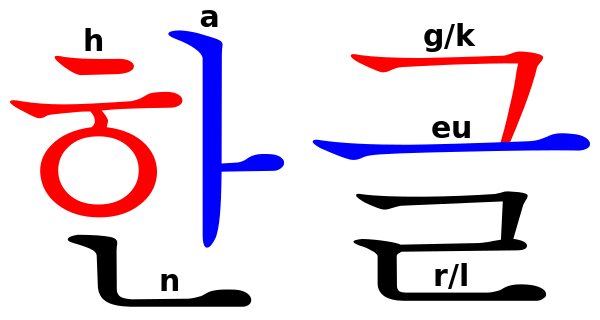

# Кодировки

- [Запись лекции](https://youtu.be/L-abgEdCKEU)

---

В основном мы, конечно, поговорим про Unicode.\
**Юникод** — это стандарт, ставящий числу в соответствие символ (например, числу 65 соответствует заглавная латинская буква `'A'`). Числа при этом называются **code point**'ами, и текст по сути представляется последовательностью code point'ов. Сами числа при этом лежат в диапазоне от `0` до `0x10FFFF`. Очень весёлый диапазон. При этом в нём ещё и дырка есть от `0xD800` до `0xDFFF`.

Рядом с Юникодом лежат кодировки, ассоциированные с ним: UTF-8, UTF-16 (+ UCS2) и UTF-32. При этом последние два также могут быть little- или big-endian. UTF-8 состоит из 8-битных чисел, UTF-16 и USC2 — 16-битных, UTF-32 — 32-битных. Эти самые числа называются **code unit**'ами. Кодировки эти занимаются тем, что определяют, как преобразовать code point в code unit.

При этом непрерывный диапазон в `0xFFFF` символов называется **плоскостью**. Их, как несложно заметить, 17 штук. Нулевая (`0`–`0xFFFF`) называется **базовой**, остальные — **расширенными**.

## Кодировки.

### UTF-32.

UTF-32 делает всё очень просто: каждый code point является одним code unit'ом. У этого есть существенный недостаток: 4 байта — безмерно много. Особенно учитывая тот факт, что символы из расширенных плоскостей встречаются редко.

### UCS2.

UCS2 не поддерживает расширенные плоскости. Кодировка эта из того времени, когда расширенных плоскостей не было, и там она просто сопоставляла code point'у code unit. Сейчас вместо неё UTF-16.

### UTF-16.

Как было сказано, в Unicode есть дырка в code point'ах от `0xD800` до `0xDFFF`. Именно эта дырка используется, чтобы кодировать расширенные плоскости.

То есть все code point'ы меньше `0x10000` кодируются в один code unit с таким же значением. А если code point больше либо равен `0x10000`, то из него вычитается `0x10000` и получается 20 бит, которые кодируются так: старшие 10 бит складываются с `0xD800`, а младшие — с `0xDC00`, после чего получаются два code unit'а. Эти два code unit'а и кодируют данный code point. Такие два code unit'а называются **суррогатной парой**. Первый — старший суррогат, второй — младший суррогат.

### UTF-8.

Традиционно программы использовали 8-битные кодировки. И не хочется жить с UTF-16. А представлять Юникод хочется. и придумали вот что.

|Диапазон|Первый октет|Второй октет|Третий октет|Четвёртый октет|
|-|-|-|-|-|
|`0`–`0x7F`|`0xxxxxxx`||||
|`0x80`–`0x7FF`|`110xxxxx`|`10xxxxxx`|||
|`0x800`–`0xFFFF`|`1110xxxx`|`10xxxxxx`|`10xxxxxx`||
|`0x10000`–`0x10FFFF`|`11110xxx`|`10xxxxxx`|`10xxxxxx`|`10xxxxxx`|

Что это за таблица и как её читать?\
Вы смотрите, в каком диапазоне лежит code point. Заметим, что числа в каждом диапазоне имеют не больше *k* бит, где *k* — количество букв `x` в правой части таблицы. Если заменить этим самые `x` на соответствующие биты code point'а (слева в таблице — старшие биты), получим последовательность code unit'ов, кодирующих данный code point.

Например: рассмотрим русскую букву «`а`». Её code point равен 1072 (`0x430`, `0b10000110000`). Это попадает в диапазон `0x80`–`0x7FF`. Согласно таблице, первые 5 бит надо засунуть в первый code unit, последние 6 — во второй. Получим первый: `0b11010000`, второй: `0b11110000`. Итого два code unit'а: `0xD0` и `0xB0`.

В UTF-8 code unit'ы называются **октетами** (первый октет одного code point'а называется **leading-октетом**, последующие — **trailing-октетом**).

Что ещё важно: из описанного выше получается, что одному символу можно сопоставить несколько последовательностей code unit'ов, так ведь? Ну, посмотрите. Вот `0b11000000`, `0b10000000` — это, вроде, должно быть `'\0'`, разве нет? Well, yes, but actually no. Такие штуки называются **overload sequences**, и кодировщики UTF-8 не должны их создавать, а декодировщики должны считать некорректным.

У UTF-8 есть ещё одно полезное свойство. Если мы попробуем сравнить две строки лексикографически, то окажется что побайтовое сравнение будет равносильно лексикографическому (у UTF-16 такого нет).

### Byte-order mark.

Он же «неразрывный пробел нулевой ширины». Это специальный code point, который вставляется в начало файлов для того, чтобы можно было определить, UTF-8 у вас, UTF-16LE или UTF-16BE.

## Сложности жития с Юникодом.

Казалось бы, переведите вашу строку в UTF-32 и живите с ней спокойно. Но нет, очень многие задачи В Юникоде не решаются нормально в принципе. И вот несколько примеров.

### Обращение к строке по индексу и длина строки.

Посмотрим на такую букву: «`Å`». Это один code point: «*LATIN CAPITAL A WITH RING ABOVE*», `0x00C5`. А есть ещё просто буква A и отдельный символ «*COMBINING RING ABOVE*», `0x030A`, которые вместе дают также «`Å`», но это два code point'а: `0041` и `030A`. И вот вопрос: вы при обращении по индексу хотите code point получить или всё же букву?

И это-то ладно, но есть ещё корейский алфавит «Хангыль», где буквы пишутся в разных местах, а не друг за другом.

Вот и попробуйте обратиться к нему по индексу или взять длину. Во втором случае даже непонятно, что вы получит-то хотите.

А как жить с этим-то? А на самом деле вам не бывает так часто нужно брать длину и обращаться по индексу. Вам бывает нужна конкатенация или поиск по строке. И это работает очень хорошо (поскольку UTF-8, например, специально помечает trailing-октеты иначе, нежели leading). Но иногда вы пишете растеризацию текста, и тогда да, вам придётся страдать, увы и ах.

### Поиск подстроки.

Вообще поиск подстроки работает нормально, но до тех пор, пока вы не хотите, чтобы «`Å`» и «`Å`» из примера выше были одинаковой буквой. Потому что тогда к ним примешивается ещё и символ ангстрема, например: «`Å`» (один code point, `0x212B`).\
Если вы уже расстроились, то зря, потому что жить с этим можно, для такого специально есть [алгоритмы нормализации](https://en.wikipedia.org/wiki/Unicode_equivalence#Normalization).

Впрочем, на деле, вы, возможно, хотите делать что-то более сложное. Отождествлять «`е`» и «`ё`», например. И тут уже вас ничего не спасёт: user-friendly делать сложно.

### Приведение к верхнему/нижнему регистру.

Ещё у любого Юникода есть проблемы с приведением в нижний и верхний регистр. Например, вот у буквы «`i`» какая заглавная? «`I`»? Ну, в английском да. А в турецком есть строчная «`ı`» («`i`» без точки) и заглавная «`İ`» («`I`» с точкой).\
А есть греческая буква «сигма», у которой есть две строчные версии: одна встречается на концах слов («`ς`»), другая — в серединах («`σ`»), и поэтому для приведения в нижний регистр надо смотреть на границы слов.\
Есть голландский, в котором есть диграф «`ij`», и его с точки зрения грамматики надо капитализировать всей парой целиком (несмотря на то, что обычно его пишут именно как два символа, а не как диграф, и, более того, это Юникод не рекомендует этот диграф).\
Есть немецкий, в котором есть буква [«`ß`»](https://en.wikipedia.org/wiki/%C3%9F), у которой долгое время не было заглавного варианта (поэтому при капитализации её переводили в «`SS`»), но потом, в 2008 ввели заглавный эсцет («`ẞ`»).

Мораль: капитализировать буквы — порочное занятие. Большие и маленькие буквы вообще встречаются в не таком большом количестве систем письма. Вот, грузины живут без регистра вообще, и всё у них хорошо.

### Лексикографическая сортировка.
Ещё одна задача: лексикографическая сортировка. Тоже, на самом деле, очень странное занятие. С точки зрения Юникода, буква «`Ё`» находится до всех заглавных букв, а «`ё`» — после.

Более того, в разных языках разные буквы могут стоять в разных местах. В немецком языке есть умляуты («`Ä`», «`Ö`», «`Ü`»). Они должны сортироваться так, как будто они — одно и то же. А в эстонском эти же буквы разные и находятся в конце алфавита.

## Взаимодействие с операционными системами.

Пока вы сидите на Linux'е, там почти всё живёт с UTF-8, и всё у вас хорошо. Есть исключения (QT, например, использует UTF-16, так как она была создана давно, когда Юникод был 16-битным). Впрочем, в Linux можно использовать другую восьмибитную кодировку (при помощи переменной окружения LANG), но некоторые программы полностью это игнорирует, считая, что у нас всё в UTF-8.

Про MacOS так много не расскажем, но там тоже есть какое-то API с UTF-8, какое-то с UTF-16, но тут у нас нет столько информации, так что не будем больше ничего говорить.

А вот с Windows ситуация интересная. Она внутри себя использует UTF-16. Но у них всё ещё есть совместимость с восьмибитными кодировками, правда, долгое время нельзя было в качестве неё поставить UTF-8. И приводило это к совершенно упоротым эффектам: если вы пользуетесь набором функций с 8-битной кодировкой (которая 1251), то не существует способа конвертировать, например, название файла, так, чтобы оно конвертировалось в то, что вам хочется. Поэтому Microsoft советовали использовать их функции формата `_wfopen`, с которой всё хорошо, но тогда программа теряет в платформонезависимости. Поэтому многе чуваки делали свои библиотеки (см. Boost.Nowide), которые на Windows конвертировали строки в 16 бит и вызывали `_wfopen`, а на Linux делали просто `fopen`.\
В Windows 10, впрочем, таких приколов нет, так что вам с этим заморачиваться не надо.

Второй прикол в Windows — наличие двух разных восьмибитных кодировок. Первая — ACP (ANSI code page) (для русской Windows — 1251), вторая — OEMCP (OEM code page) (для русской Windows — 866). И разные восьмибитные функции работали в разных кодировках. Поэтому получив строку из одной функции и отдав в другую, вы могли увидеть, что строка попортилась. Что ещё интереснее, некоторые функции могут использовать одно или другое (функция `SetFileApisToOEM` переключает кодировку для работы с файлами, например).\
Мораль: на Windows ставьте обеими текущими кодировками UTF-8 и живите счастливо. А если уж вам нужно что-то старое, то вам можно только посочувствовать (но вообще выберите одну кодировку для своей программы и при необходимости конвертируйте туда-обратно).

### Имена файлов.

Впрочем, всё вышеописанное не поможет вам делать `fopen`'ы. Потому что имена файлов во многих ОС (и Windows, и Linux) не обязаны являться корректными строками. В Linux, как мы знаем, файлы могут содержать любые символы, кроме `'\0'` и `'/'`. Например, файл может быть назван `"Ha\bello"`, и многие утилиты будут выводить название файла как `"Hello"`.\
Но это то ладно. У нас может быть некорректная последовательность октетов (head octet без tail octet'а или наоборот или ещё чего). В Windows ситуация такая же: у вас может быть первый символ суррогатной пары без второго. 

Мораль: не пытайтесь преобразовать путь в строку и обратно, надеясь, что он не испортится. И не все пути можно нормально в строку преобразовать вообще.

А теперь вспомним, что имена файлов на Windows не зависят от регистра. Некорректные UTF-16 строки, не зависящие от регистра. Это, простите, что за срань? А ситуация такая: правило сопоставления маленьких букв большим прошито в файловой системе NTFS. На NTFS создаётся файлик (называется `UpCase`), в котором и хранится информация о сопоставлении маленьких букв большим. И в разных файловых системах (а значит и в разных разделах вашего компьютера) это сопоставление может быть разным.\
Да и более того. В EXT4 вы можете повесить себе на каталог опцию, чтобы в нём имена были регистронезависимы, а потом и в Windows — обратную опцию.
